// 版本：v0.1.0

// 作者：Phodal Huang

（PS 1：考虑到内容的重复度和读者一定会懂得 Google，对于部分的内容，我只编写标题。）

（PS 2：部分内容可以在书上找到对应的内容，我只会给个书名）

（PS 3：我在寒冷的北方杭州，写下了此指南）

Phodal 手把手教你分析、评估现有系统、制定重构策略、探索可行重构方案、搭建测试防护网、进行系统架构重构、服务架构重构、模块重构、代码重构、数据库重构、重构后的架构守护……。

对就是这些，但是还没完呢。

指南中所包含的书单：

 - 《重构与模式》
 - 《设计模式：可复用面向对象软件的基础》
 - 《重构：改善既有代码的设计》
 - 《领域驱动设计：软件核心复杂性应对之道》
 - 《修改代码的艺术：构建易维护代码的 9 条最佳实践》
 - 《代码整洁之道》
 - 《架构整洁之道》
 - 《数据库重构》
 - 《遗留系统重构指南》
 - 《软件架构师应该知道的97件事》
 - 《架构师修炼之道》 
 - 《实现模式》
 - 《反模式：危机中的软件，架构和项目的重构》
 - 《精益软件度量》
 - 《设计模式沉思录》
 - 《前端架构：从入门到微前端》

# [系统重构与迁移指南](https://migration.ink/)

> 软件开发总成本 = 开发成本 + 维护成本；软件维护成本 = 理解成本 + 修改成本 + 测试成本 + 部署成本。—— Kent Beck

最新版本内容，请访问：[https://migration.ink/](https://migration.ink/)，或者 [https://github.com/phodal/migration](https://github.com/phodal/migration)

模型与原则：

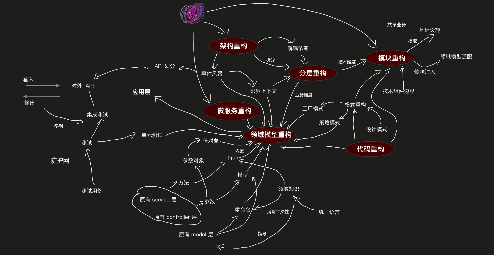

流程：

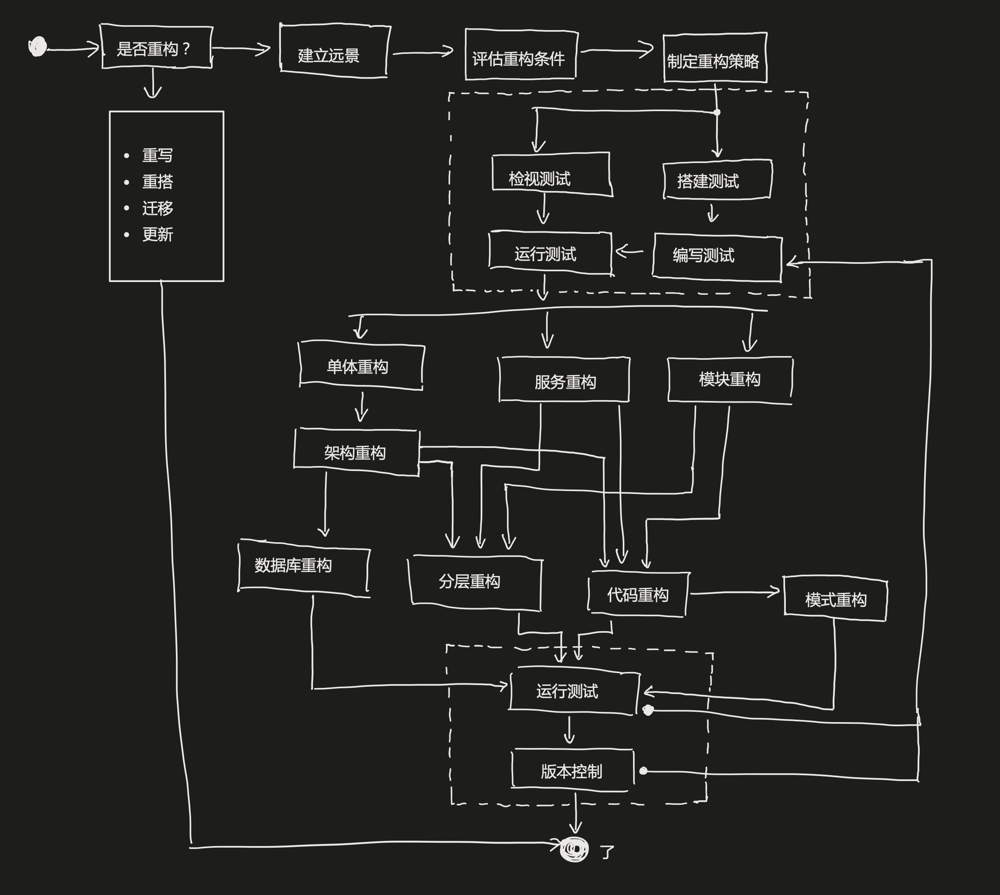

索引：

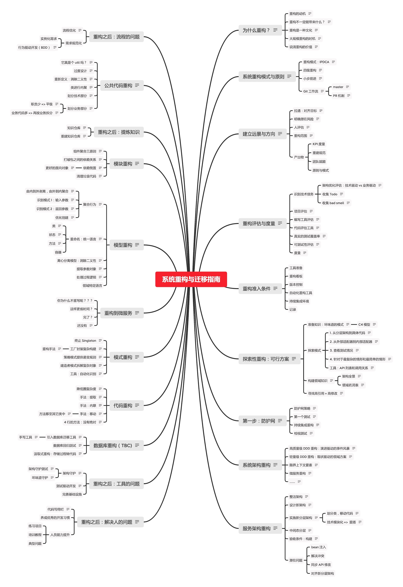

目录：

*   [再说遗留系统重构](#%E5%86%8D%E8%AF%B4%E9%81%97%E7%95%99%E7%B3%BB%E7%BB%9F%E9%87%8D%E6%9E%84)
*   [为什么重构？](#%E4%B8%BA%E4%BB%80%E4%B9%88%E9%87%8D%E6%9E%84%EF%BC%9F)
    *   [重构的动机](#%E9%87%8D%E6%9E%84%E7%9A%84%E5%8A%A8%E6%9C%BA)
    *   [重构不一定能带来什么？](#%E9%87%8D%E6%9E%84%E4%B8%8D%E4%B8%80%E5%AE%9A%E8%83%BD%E5%B8%A6%E6%9D%A5%E4%BB%80%E4%B9%88%EF%BC%9F)
    *   [重构是一种文化](#%E9%87%8D%E6%9E%84%E6%98%AF%E4%B8%80%E7%A7%8D%E6%96%87%E5%8C%96)
    *   [大规模重构的时机](#%E5%A4%A7%E8%A7%84%E6%A8%A1%E9%87%8D%E6%9E%84%E7%9A%84%E6%97%B6%E6%9C%BA)
    *   [说清重构的价值](#%E8%AF%B4%E6%B8%85%E9%87%8D%E6%9E%84%E7%9A%84%E4%BB%B7%E5%80%BC)
*   [系统重构模式与原则](#%E7%B3%BB%E7%BB%9F%E9%87%8D%E6%9E%84%E6%A8%A1%E5%BC%8F%E4%B8%8E%E5%8E%9F%E5%88%99)
    *   [重构模式：EPDCA](#%E9%87%8D%E6%9E%84%E6%A8%A1%E5%BC%8F%EF%BC%9Aipdca)
    *   [四级重构](#%E5%9B%9B%E7%BA%A7%E9%87%8D%E6%9E%84)
    *   [小步前进](#%E5%B0%8F%E6%AD%A5%E5%89%8D%E8%BF%9B)
    *   [Git 工作流](#git--%E5%B7%A5%E4%BD%9C%E6%B5%81)
        *   [Master 机制](#master-%E6%9C%BA%E5%88%B6)
        *   [PR 机制](#pr-%E6%9C%BA%E5%88%B6)
*   [建立远景与方向](#%E5%BB%BA%E7%AB%8B%E8%BF%9C%E6%99%AF%E4%B8%8E%E6%96%B9%E5%90%91)
    *   [拉通：对齐目标](#%E6%8B%89%E9%80%9A%EF%BC%9A%E5%AF%B9%E9%BD%90%E7%9B%AE%E6%A0%87)
    *   [明确潜在风险](#%E6%98%8E%E7%A1%AE%E6%BD%9C%E5%9C%A8%E9%A3%8E%E9%99%A9)
    *   [人评估](#%E4%BA%BA%E8%AF%84%E4%BC%B0)
    *   [重构范围](#%E9%87%8D%E6%9E%84%E8%8C%83%E5%9B%B4)
    *   [产出物](#%E4%BA%A7%E5%87%BA%E7%89%A9)
        *   [KPI 度量](#kpi-%E5%BA%A6%E9%87%8F)
        *   [重建规范](#%E9%87%8D%E5%BB%BA%E8%A7%84%E8%8C%83)
        *   [团队赋能](#%E5%9B%A2%E9%98%9F%E8%B5%8B%E8%83%BD)
        *   [原则与模式](#%E5%8E%9F%E5%88%99%E4%B8%8E%E6%A8%A1%E5%BC%8F)
*   [重构评估与度量](#%E9%87%8D%E6%9E%84%E8%AF%84%E4%BC%B0%E4%B8%8E%E5%BA%A6%E9%87%8F)
    *   [识别技术债务](#%E8%AF%86%E5%88%AB%E6%8A%80%E6%9C%AF%E5%80%BA%E5%8A%A1)
        *   [技术债风暴](#%E6%8A%80%E6%9C%AF%E5%80%BA%E9%A3%8E%E6%9A%B4)
        *   [架构评估：技术驱动 vs 业务驱动](#%E6%9E%B6%E6%9E%84%E8%AF%84%E4%BC%B0%EF%BC%9A%E6%8A%80%E6%9C%AF%E9%A9%B1%E5%8A%A8-vs-%E4%B8%9A%E5%8A%A1%E9%A9%B1%E5%8A%A8)
        *   [代码评估：收集 bad smell](#%E4%BB%A3%E7%A0%81%E8%AF%84%E4%BC%B0%EF%BC%9A%E6%94%B6%E9%9B%86-bad-smell)
        *   [收集 Todo](#%E6%94%B6%E9%9B%86-todo)
        *   [测试和文档评估](#%E6%B5%8B%E8%AF%95%E5%92%8C%E6%96%87%E6%A1%A3%E8%AF%84%E4%BC%B0)
    *   [项目评估](#%E9%A1%B9%E7%9B%AE%E8%AF%84%E4%BC%B0)
    *   [编写工具评估](#%E7%BC%96%E5%86%99%E5%B7%A5%E5%85%B7%E8%AF%84%E4%BC%B0)
    *   [代码评估工具](#%E4%BB%A3%E7%A0%81%E8%AF%84%E4%BC%B0%E5%B7%A5%E5%85%B7)
    *   [真实的测试覆盖率](#%E7%9C%9F%E5%AE%9E%E7%9A%84%E6%B5%8B%E8%AF%95%E8%A6%86%E7%9B%96%E7%8E%87)
    *   [可测试性评估](#%E5%8F%AF%E6%B5%8B%E8%AF%95%E6%80%A7%E8%AF%84%E4%BC%B0)
    *   [度量](#%E5%BA%A6%E9%87%8F)
    *   [寻找专业人士](#%E5%AF%BB%E6%89%BE%E4%B8%93%E4%B8%9A%E4%BA%BA%E5%A3%AB)
*   [重构准入条件](#%E9%87%8D%E6%9E%84%E5%87%86%E5%85%A5%E6%9D%A1%E4%BB%B6)
    *   [工具准备](#%E5%B7%A5%E5%85%B7%E5%87%86%E5%A4%87)
    *   [重构看板](#%E9%87%8D%E6%9E%84%E7%9C%8B%E6%9D%BF)
    *   [版本控制](#%E7%89%88%E6%9C%AC%E6%8E%A7%E5%88%B6)
    *   [自动化重构工具](#%E8%87%AA%E5%8A%A8%E5%8C%96%E9%87%8D%E6%9E%84%E5%B7%A5%E5%85%B7)
    *   [持续集成环境](#%E6%8C%81%E7%BB%AD%E9%9B%86%E6%88%90%E7%8E%AF%E5%A2%83)
    *   [记录](#%E8%AE%B0%E5%BD%95)
*   [探索性重构：可行方案](#%E6%8E%A2%E7%B4%A2%E6%80%A7%E9%87%8D%E6%9E%84%EF%BC%9A%E5%8F%AF%E8%A1%8C%E6%96%B9%E6%A1%88)
    *   [准备知识：坏味道的模式](#%E5%87%86%E5%A4%87%E7%9F%A5%E8%AF%86%EF%BC%9A%E5%9D%8F%E5%91%B3%E9%81%93%E7%9A%84%E6%A8%A1%E5%BC%8F)
        *   [C4 模型](#c4-%E6%A8%A1%E5%9E%8B)
    *   [探索模式](#%E6%8E%A2%E7%B4%A2%E6%A8%A1%E5%BC%8F)
        *   [1\. 从分层架构到具体代码](#1-%E4%BB%8E%E5%88%86%E5%B1%82%E6%9E%B6%E6%9E%84%E5%88%B0%E5%85%B7%E4%BD%93%E4%BB%A3%E7%A0%81)
        *   [2\. 从外部适配器到内部适配器](#2-%E4%BB%8E%E5%A4%96%E9%83%A8%E9%80%82%E9%85%8D%E5%99%A8%E5%88%B0%E5%86%85%E9%83%A8%E9%80%82%E9%85%8D%E5%99%A8)
        *   [3\. 查看测试情况](#3-%E6%9F%A5%E7%9C%8B%E6%B5%8B%E8%AF%95%E6%83%85%E5%86%B5)
        *   [4\. 针对于最复杂的情形和最简单的情形](#4-%E9%92%88%E5%AF%B9%E4%BA%8E%E6%9C%80%E5%A4%8D%E6%9D%82%E7%9A%84%E6%83%85%E5%BD%A2%E5%92%8C%E6%9C%80%E7%AE%80%E5%8D%95%E7%9A%84%E6%83%85%E5%BD%A2)
        *   [工具：API 列表和调用关系](#%E5%B7%A5%E5%85%B7%EF%BC%9Aapi-%E5%88%97%E8%A1%A8%E5%92%8C%E8%B0%83%E7%94%A8%E5%85%B3%E7%B3%BB)
    *   [构建领域知识](#%E6%9E%84%E5%BB%BA%E9%A2%86%E5%9F%9F%E7%9F%A5%E8%AF%86)
        *   [了解业务架构](#%E4%BA%86%E8%A7%A3%E4%B8%9A%E5%8A%A1%E6%9E%B6%E6%9E%84)
        *   [架构全景](#%E6%9E%B6%E6%9E%84%E5%85%A8%E6%99%AF)
        *   [领域名词表](#%E9%A2%86%E5%9F%9F%E5%90%8D%E8%AF%8D%E8%A1%A8)
    *   [寻找高引用 + 高修改](#%E5%AF%BB%E6%89%BE%E9%AB%98%E5%BC%95%E7%94%A8--%E9%AB%98%E4%BF%AE%E6%94%B9)
*   [第一步：防护网](#%E7%AC%AC%E4%B8%80%E6%AD%A5%EF%BC%9A%E9%98%B2%E6%8A%A4%E7%BD%91)
    *   [防护网策略](#%E9%98%B2%E6%8A%A4%E7%BD%91%E7%AD%96%E7%95%A5)
    *   [第一个测试](#%E7%AC%AC%E4%B8%80%E4%B8%AA%E6%B5%8B%E8%AF%95)
    *   [持续集成重构](#%E6%8C%81%E7%BB%AD%E9%9B%86%E6%88%90%E9%87%8D%E6%9E%84)
    *   [检视测试](#%E6%A3%80%E8%A7%86%E6%B5%8B%E8%AF%95)
*   [系统架构重构](#%E7%B3%BB%E7%BB%9F%E6%9E%B6%E6%9E%84%E9%87%8D%E6%9E%84)
    *   [高质量级 DDD 重构：演进驱动的事件风暴](#%E9%AB%98%E8%B4%A8%E9%87%8F%E7%BA%A7-ddd-%E9%87%8D%E6%9E%84%EF%BC%9A%E6%BC%94%E8%BF%9B%E9%A9%B1%E5%8A%A8%E7%9A%84%E4%BA%8B%E4%BB%B6%E9%A3%8E%E6%9A%B4)
    *   [轻量级 DDD 重构：现状驱动的领域方案](#%E8%BD%BB%E9%87%8F%E7%BA%A7-ddd-%E9%87%8D%E6%9E%84%EF%BC%9A%E7%8E%B0%E7%8A%B6%E9%A9%B1%E5%8A%A8%E7%9A%84%E9%A2%86%E5%9F%9F%E6%96%B9%E6%A1%88)
    *   [限界上下文要素](#%E9%99%90%E7%95%8C%E4%B8%8A%E4%B8%8B%E6%96%87%E8%A6%81%E7%B4%A0)
    *   [微服务重构](#%E5%BE%AE%E6%9C%8D%E5%8A%A1%E9%87%8D%E6%9E%84)
    *   [……](#%E2%80%A6%E2%80%A6)
*   [服务架构重构](#%E6%9C%8D%E5%8A%A1%E6%9E%B6%E6%9E%84%E9%87%8D%E6%9E%84)
    *   [整洁架构](#%E6%95%B4%E6%B4%81%E6%9E%B6%E6%9E%84)
    *   [设计新架构](#%E8%AE%BE%E8%AE%A1%E6%96%B0%E6%9E%B6%E6%9E%84)
    *   [实施新分层架构](#%E5%AE%9E%E6%96%BD%E6%96%B0%E5%88%86%E5%B1%82%E6%9E%B6%E6%9E%84)
        *   [划分类，移动代码](#%E5%88%92%E5%88%86%E7%B1%BB%EF%BC%8C%E7%A7%BB%E5%8A%A8%E4%BB%A3%E7%A0%81)
        *   [技术模块化 => 重搭](#%E6%8A%80%E6%9C%AF%E6%A8%A1%E5%9D%97%E5%8C%96--%E9%87%8D%E6%90%AD)
    *   [中间态分层](#%E4%B8%AD%E9%97%B4%E6%80%81%E5%88%86%E5%B1%82)
    *   [验收条件：构建](#%E9%AA%8C%E6%94%B6%E6%9D%A1%E4%BB%B6%EF%BC%9A%E6%9E%84%E5%BB%BA)
    *   [潜在问题](#%E6%BD%9C%E5%9C%A8%E9%97%AE%E9%A2%98)
        *   [bean 注入](#bean-%E6%B3%A8%E5%85%A5)
        *   [解决冲突](#%E8%A7%A3%E5%86%B3%E5%86%B2%E7%AA%81)
        *   [同步 API 修改](#%E5%90%8C%E6%AD%A5-api-%E4%BF%AE%E6%94%B9)
        *   [对齐新分层架构](#%E5%AF%B9%E9%BD%90%E6%96%B0%E5%88%86%E5%B1%82%E6%9E%B6%E6%9E%84)
*   [公共代码重构](#%E5%85%AC%E5%85%B1%E4%BB%A3%E7%A0%81%E9%87%8D%E6%9E%84)
    *   [它真是个 util 吗？](#%E5%AE%83%E7%9C%9F%E6%98%AF%E4%B8%AA-util-%E5%90%97%EF%BC%9F)
    *   [过度设计](#%E8%BF%87%E5%BA%A6%E8%AE%BE%E8%AE%A1)
    *   [重新定义：消除二义性](#%E9%87%8D%E6%96%B0%E5%AE%9A%E4%B9%89%EF%BC%9A%E6%B6%88%E9%99%A4%E4%BA%8C%E4%B9%89%E6%80%A7)
    *   [类进行内聚](#%E7%B1%BB%E8%BF%9B%E8%A1%8C%E5%86%85%E8%81%9A)
    *   [划分技术部分](#%E5%88%92%E5%88%86%E6%8A%80%E6%9C%AF%E9%83%A8%E5%88%86)
    *   [划分业务部分](#%E5%88%92%E5%88%86%E4%B8%9A%E5%8A%A1%E9%83%A8%E5%88%86)
        *   [职责少 => 平级](#%E8%81%8C%E8%B4%A3%E5%B0%91--%E5%B9%B3%E7%BA%A7)
        *   [业务代码多 => 再按业务拆分](#%E4%B8%9A%E5%8A%A1%E4%BB%A3%E7%A0%81%E5%A4%9A--%E5%86%8D%E6%8C%89%E4%B8%9A%E5%8A%A1%E6%8B%86%E5%88%86)
*   [模块重构](#%E6%A8%A1%E5%9D%97%E9%87%8D%E6%9E%84)
    *   [组件聚合三原则](#%E7%BB%84%E4%BB%B6%E8%81%9A%E5%90%88%E4%B8%89%E5%8E%9F%E5%88%99)
    *   [打破包之间的依赖关系](#%E6%89%93%E7%A0%B4%E5%8C%85%E4%B9%8B%E9%97%B4%E7%9A%84%E4%BE%9D%E8%B5%96%E5%85%B3%E7%B3%BB)
    *   [依赖倒置](#%E4%BE%9D%E8%B5%96%E5%80%92%E7%BD%AE)
        *   [更好的面向对象](#%E6%9B%B4%E5%A5%BD%E7%9A%84%E9%9D%A2%E5%90%91%E5%AF%B9%E8%B1%A1)
    *   [清理垃圾代码](#%E6%B8%85%E7%90%86%E5%9E%83%E5%9C%BE%E4%BB%A3%E7%A0%81)
*   [模型重构](#%E6%A8%A1%E5%9E%8B%E9%87%8D%E6%9E%84)
    *   [聚合行为](#%E8%81%9A%E5%90%88%E8%A1%8C%E4%B8%BA)
        *   [由内到外剥离，由外到内聚合](#%E7%94%B1%E5%86%85%E5%88%B0%E5%A4%96%E5%89%A5%E7%A6%BB%EF%BC%8C%E7%94%B1%E5%A4%96%E5%88%B0%E5%86%85%E8%81%9A%E5%90%88)
        *   [识别模式 1：输入参数](#%E8%AF%86%E5%88%AB%E6%A8%A1%E5%BC%8F-1%EF%BC%9A%E8%BE%93%E5%85%A5%E5%8F%82%E6%95%B0)
        *   [识别模式 2：返回参数](#%E8%AF%86%E5%88%AB%E6%A8%A1%E5%BC%8F-2%EF%BC%9A%E8%BF%94%E5%9B%9E%E5%8F%82%E6%95%B0)
        *   [优化创建](#%E4%BC%98%E5%8C%96%E5%88%9B%E5%BB%BA)
    *   [重命名：统一语言](#%E9%87%8D%E5%91%BD%E5%90%8D%EF%BC%9A%E7%BB%9F%E4%B8%80%E8%AF%AD%E8%A8%80)
        *   [类](#%E7%B1%BB)
        *   [状态](#%E7%8A%B6%E6%80%81)
        *   [方法](#%E6%96%B9%E6%B3%95)
        *   [容器](#%E5%AE%B9%E5%99%A8)
    *   [离心分离模型：消除二义性](#%E7%A6%BB%E5%BF%83%E5%88%86%E7%A6%BB%E6%A8%A1%E5%9E%8B%EF%BC%9A%E6%B6%88%E9%99%A4%E4%BA%8C%E4%B9%89%E6%80%A7)
    *   [提取参数对象](#%E6%8F%90%E5%8F%96%E5%8F%82%E6%95%B0%E5%AF%B9%E8%B1%A1)
    *   [处理过程逻辑](#%E5%A4%84%E7%90%86%E8%BF%87%E7%A8%8B%E9%80%BB%E8%BE%91)
    *   [领域特定语言](#%E9%A2%86%E5%9F%9F%E7%89%B9%E5%AE%9A%E8%AF%AD%E8%A8%80)
*   [模式重构](#%E6%A8%A1%E5%BC%8F%E9%87%8D%E6%9E%84)
    *   [终止 Singleton](#%E7%BB%88%E6%AD%A2-singleton)
    *   [工厂封装复杂构建](#%E5%B7%A5%E5%8E%82%E5%B0%81%E8%A3%85%E5%A4%8D%E6%9D%82%E6%9E%84%E5%BB%BA)
        *   [重构手法](#%E9%87%8D%E6%9E%84%E6%89%8B%E6%B3%95)
    *   [策略模式提供易变规则](#%E7%AD%96%E7%95%A5%E6%A8%A1%E5%BC%8F%E6%8F%90%E4%BE%9B%E6%98%93%E5%8F%98%E8%A7%84%E5%88%99)
    *   [建造者模式拆解复杂对象](#%E5%BB%BA%E9%80%A0%E8%80%85%E6%A8%A1%E5%BC%8F%E6%8B%86%E8%A7%A3%E5%A4%8D%E6%9D%82%E5%AF%B9%E8%B1%A1)
    *   [工具：自动化识别](#%E5%B7%A5%E5%85%B7%EF%BC%9A%E8%87%AA%E5%8A%A8%E5%8C%96%E8%AF%86%E5%88%AB)
*   [代码重构](#%E4%BB%A3%E7%A0%81%E9%87%8D%E6%9E%84)
    *   [降低圈复杂度](#%E9%99%8D%E4%BD%8E%E5%9C%88%E5%A4%8D%E6%9D%82%E5%BA%A6)
    *   [手法：提取](#%E6%89%8B%E6%B3%95%EF%BC%9A%E6%8F%90%E5%8F%96)
    *   [手法：内联](#%E6%89%8B%E6%B3%95%EF%BC%9A%E5%86%85%E8%81%94)
    *   [手法：移动](#%E6%89%8B%E6%B3%95%EF%BC%9A%E7%A7%BB%E5%8A%A8)
        *   [方法移至其它类中](#%E6%96%B9%E6%B3%95%E7%A7%BB%E8%87%B3%E5%85%B6%E5%AE%83%E7%B1%BB%E4%B8%AD)
    *   [标准：4 行的方法](#%E6%A0%87%E5%87%86%EF%BC%9A4-%E8%A1%8C%E7%9A%84%E6%96%B9%E6%B3%95)
*   [重构示例](#%E9%87%8D%E6%9E%84%E7%A4%BA%E4%BE%8B)
    *   [评估](#%E8%AF%84%E4%BC%B0)
        *   [C4 模型展开](#c4-%E6%A8%A1%E5%9E%8B%E5%B1%95%E5%BC%80)
    *   [工具评估](#%E5%B7%A5%E5%85%B7%E8%AF%84%E4%BC%B0)
        *   [代码统计](#%E4%BB%A3%E7%A0%81%E7%BB%9F%E8%AE%A1)
        *   [基本情况评估](#%E5%9F%BA%E6%9C%AC%E6%83%85%E5%86%B5%E8%AF%84%E4%BC%B0)
        *   [代码坏味道评估](#%E4%BB%A3%E7%A0%81%E5%9D%8F%E5%91%B3%E9%81%93%E8%AF%84%E4%BC%B0)
        *   [架构评估](#%E6%9E%B6%E6%9E%84%E8%AF%84%E4%BC%B0)
        *   [API 评估](#api-%E8%AF%84%E4%BC%B0)
        *   [API 架构图](#api-%E6%9E%B6%E6%9E%84%E5%9B%BE)
        *   [高引用 + 高修改分析](#%E9%AB%98%E5%BC%95%E7%94%A8--%E9%AB%98%E4%BF%AE%E6%94%B9%E5%88%86%E6%9E%90)
        *   [测试](#%E6%B5%8B%E8%AF%95)
    *   [重构策略](#%E9%87%8D%E6%9E%84%E7%AD%96%E7%95%A5)
    *   [架构重构](#%E6%9E%B6%E6%9E%84%E9%87%8D%E6%9E%84)
    *   [分层重构](#%E5%88%86%E5%B1%82%E9%87%8D%E6%9E%84)
    *   [模型重构](#%E6%A8%A1%E5%9E%8B%E9%87%8D%E6%9E%84-1)
    *   [代码重构](#%E4%BB%A3%E7%A0%81%E9%87%8D%E6%9E%84-1)
*   [自动化重构](#%E8%87%AA%E5%8A%A8%E5%8C%96%E9%87%8D%E6%9E%84)
*   [数据库重构（TBC）](#%E6%95%B0%E6%8D%AE%E5%BA%93%E9%87%8D%E6%9E%84%EF%BC%88tbc%EF%BC%89)
    *   [数据库回归测试：数据不变性](#%E6%95%B0%E6%8D%AE%E5%BA%93%E5%9B%9E%E5%BD%92%E6%B5%8B%E8%AF%95%EF%BC%9A%E6%95%B0%E6%8D%AE%E4%B8%8D%E5%8F%98%E6%80%A7)
        *   [前测试](#%E5%89%8D%E6%B5%8B%E8%AF%95)
        *   [后测试](#%E5%90%8E%E6%B5%8B%E8%AF%95)
    *   [引入数据库迁移工具](#%E5%BC%95%E5%85%A5%E6%95%B0%E6%8D%AE%E5%BA%93%E8%BF%81%E7%A7%BB%E5%B7%A5%E5%85%B7)
    *   [迁移源数据](#%E8%BF%81%E7%A7%BB%E6%BA%90%E6%95%B0%E6%8D%AE)
    *   [汲取式重构：存储过程转换](#%E6%B1%B2%E5%8F%96%E5%BC%8F%E9%87%8D%E6%9E%84%EF%BC%9A%E5%AD%98%E5%82%A8%E8%BF%87%E7%A8%8B%E8%BD%AC%E6%8D%A2)
*   [重构之后：工具的问题](#%E9%87%8D%E6%9E%84%E4%B9%8B%E5%90%8E%EF%BC%9A%E5%B7%A5%E5%85%B7%E7%9A%84%E9%97%AE%E9%A2%98)
    *   [架构守护](#%E6%9E%B6%E6%9E%84%E5%AE%88%E6%8A%A4)
        *   [架构守护测试](#%E6%9E%B6%E6%9E%84%E5%AE%88%E6%8A%A4%E6%B5%8B%E8%AF%95)
        *   [坏味道守护](#%E5%9D%8F%E5%91%B3%E9%81%93%E5%AE%88%E6%8A%A4)
    *   [测试驱动开发](#%E6%B5%8B%E8%AF%95%E9%A9%B1%E5%8A%A8%E5%BC%80%E5%8F%91)
    *   [完善基础设施](#%E5%AE%8C%E5%96%84%E5%9F%BA%E7%A1%80%E8%AE%BE%E6%96%BD)
*   [重构之后：解决人的问题](#%E9%87%8D%E6%9E%84%E4%B9%8B%E5%90%8E%EF%BC%9A%E8%A7%A3%E5%86%B3%E4%BA%BA%E7%9A%84%E9%97%AE%E9%A2%98)
    *   [代码写得烂](#%E4%BB%A3%E7%A0%81%E5%86%99%E5%BE%97%E7%83%82)
    *   [养成优秀的开发习惯](#%E5%85%BB%E6%88%90%E4%BC%98%E7%A7%80%E7%9A%84%E5%BC%80%E5%8F%91%E4%B9%A0%E6%83%AF)
    *   [人员能力提升](#%E4%BA%BA%E5%91%98%E8%83%BD%E5%8A%9B%E6%8F%90%E5%8D%87)
        *   [练习项目](#%E7%BB%83%E4%B9%A0%E9%A1%B9%E7%9B%AE)
        *   [培训教程](#%E5%9F%B9%E8%AE%AD%E6%95%99%E7%A8%8B)
        *   [典型问题](#%E5%85%B8%E5%9E%8B%E9%97%AE%E9%A2%98)
*   [重构之后：流程的问题](#%E9%87%8D%E6%9E%84%E4%B9%8B%E5%90%8E%EF%BC%9A%E6%B5%81%E7%A8%8B%E7%9A%84%E9%97%AE%E9%A2%98)
    *   [流程优化](#%E6%B5%81%E7%A8%8B%E4%BC%98%E5%8C%96)
    *   [需求规范化](#%E9%9C%80%E6%B1%82%E8%A7%84%E8%8C%83%E5%8C%96)
        *   [实例化需求](#%E5%AE%9E%E4%BE%8B%E5%8C%96%E9%9C%80%E6%B1%82)
        *   [行为驱动开发（BDD）](#%E8%A1%8C%E4%B8%BA%E9%A9%B1%E5%8A%A8%E5%BC%80%E5%8F%91%EF%BC%88bdd%EF%BC%89)
*   [重构之后：提炼知识](#%E9%87%8D%E6%9E%84%E4%B9%8B%E5%90%8E%EF%BC%9A%E6%8F%90%E7%82%BC%E7%9F%A5%E8%AF%86)
    *   [知识仓库](#%E7%9F%A5%E8%AF%86%E4%BB%93%E5%BA%93)
    *   [重建知识仓库](#%E9%87%8D%E5%BB%BA%E7%9F%A5%E8%AF%86%E4%BB%93%E5%BA%93)
*   [问题是什么？](#%E9%97%AE%E9%A2%98%E6%98%AF%E4%BB%80%E4%B9%88%EF%BC%9F)
    *   [为什么我们需要重构？](#%E4%B8%BA%E4%BB%80%E4%B9%88%E6%88%91%E4%BB%AC%E9%9C%80%E8%A6%81%E9%87%8D%E6%9E%84%EF%BC%9F)
*   [重构到微服务](#%E9%87%8D%E6%9E%84%E5%88%B0%E5%BE%AE%E6%9C%8D%E5%8A%A1)
*   [未来](#%E6%9C%AA%E6%9D%A5)
    *   [追求技术卓越。](#%E8%BF%BD%E6%B1%82%E6%8A%80%E6%9C%AF%E5%8D%93%E8%B6%8A%E3%80%82)
    *   [推动个人变革，进而引领组织变革](#%E6%8E%A8%E5%8A%A8%E4%B8%AA%E4%BA%BA%E5%8F%98%E9%9D%A9%EF%BC%8C%E8%BF%9B%E8%80%8C%E5%BC%95%E9%A2%86%E7%BB%84%E7%BB%87%E5%8F%98%E9%9D%A9)
    *   [整理知识，加强教育](#%E6%95%B4%E7%90%86%E7%9F%A5%E8%AF%86%EF%BC%8C%E5%8A%A0%E5%BC%BA%E6%95%99%E8%82%B2)
    *   [在整个流程中将价值创造最大化](#%E5%9C%A8%E6%95%B4%E4%B8%AA%E6%B5%81%E7%A8%8B%E4%B8%AD%E5%B0%86%E4%BB%B7%E5%80%BC%E5%88%9B%E9%80%A0%E6%9C%80%E5%A4%A7%E5%8C%96)
    

## 再说遗留系统重构

> 当你试图对工作方式进行这些改进时，政治斗争可能抬起它丑陋的头——《拥抱变革：从优秀走向卓越的 48 个组织转型模式》

4 年前，也就是 2016 年，我一直在思索着如何更好的构建软件？如何更好的重写软件系统？思索出了 RePractise 七步曲，顺带着写了那本《全栈应用开发：精益实践》。书中，对于遗留系统的建议，便是**重写**。

而在我的最近一本书《[前端架构：从入门到微前端](https://book.douban.com/subject/33477112/)》中，我提及到了五种前端架构的改进方式：更新、迁移、重构、重写、重搭。重写，依旧是我推荐的主要方式，技术栈老旧、旧有代码不规范。

可是呢，随着岁月的流失，我发现重写并不能大部分的解决问题。

我总以为，编写软件的的人会随着年龄的增长，写出更好的软件系统。然而，软件开发者在经历到了 3 ~ 5 年的职业编码之后，有些成为了技术管理者，写不下去的转行、在线炒粉去了，还有的 `return true` 成为了销售……，剩下的，还有那个不断接锅的 Tech Lead（还在继续写代码）。就好像韭菜一样，总可以吃掉新鲜的，总会由新的人来开发新的系统。所以，《重构：改善既有代码的设计》总是能割到一波又一波的韭菜 —— 那个会重构的人，代码写得少了。

时过境迁，我对软件开发又有一些新的领悟：重构比重写更有挑战性。或许是重写和新写没有区别，或者是经历了一个个系统的重构过程，我大抵是明白了：**哪来的和旧系统划清界线**。系统腐烂时，没有人能说清整个系统，甚至于一半的功能都相当的困难。与此同时，或许系统的用户对系统的功能比你更加了解。因为，你会从他们那收到 bug 的反馈：以前不是有这个功能吗，非常好用 —— 用户可能会骗你，他/她经常用那个功能，但是那个功能是存在的。

从旧系统中汲取知识，一个逃离不了的话题，一个永远的痛。系统重构并不是一个简单的活，我们要不断地平衡：业务开发与重构过程，并尽量保证业务优先。它还涉及到一系列的软件开发实践：

 - 创建重构防护网，保证重构过程的安全性
 - 可随时继续的重构演进策略
 - 评估
 - API 设计合理性评估
 - 模块分层架构
 - 架构合理度评估与对应的改进方案
 - 公共代码的拆分策略
 - 面向过程代码转面向对象
 - 代码坏味道识别与代码重构
 - 合适的设计模式替换旧的散弹式修改
 - ……

也因此，在先前提到的 5 种方式中，重构可以说是最难的一种。设计新的架构很容易，但是要重构到设计模式，重构到领域驱动设计，重构到整洁的架构，并不是一件容易的事情。你需要持续不断地练习，但是这样的机会并不多。

可重构到最后，我们还会再回过头来看这些问题。我们的重点应该是：解决提出问题的人。正是那些能力不够的开发人员，导致了我们的系统需要一次大规模的重构。

那么，正确的做法，应该是在日常的开发中不断重构，并引入技术债看板，不断优化和解决这些技术债。故而，技术债管理优于重构。

## 为什么重构？

> 重构（名词）：对软件内部结构的一种调整，目的是在不改变软件可观察行为的前提下，提高其可理解性，降低其修改成本。 重构（动词）：使用一系列重构手法，在不改变软件可观察行为的前提下，调整其结构。

从定义上来说，重构意味着，我们不能改变现有软件的行为，你的 bug 还应该是 bug。只是呢，我们可以顺带着修复这个 bug，但是它绝不能冠上重构的名义。如此一来，怕是会被人误解。

既然，不添加新的功能，也不减少现有的功能，那对于业务系统来说有什么价值呢？

> 重构的唯一目的就是让我们开发更快，用更少的工作量创造更大的价值。—— 《重构：改善既有代码的设计》

所以，总的来说，重构是为了 `￥￥￥`。如果不能创造更多的价值，那么你在扯什么犊子的重构。但是，这种价值往往都不是直接体现。

### 重构的动机

我知道你已经熟悉了这些说辞，而我也是复制过来的：

 - 改善既有代码的设计。副标题是最好的说明。
 - 帮助找到软件中的 bug。review 旧有代码的过程中，会发现一些不符合业务的代码。
 - 提升开发效率。让代码易于扩展
 - 提高编程的趣味性——《重构与模式》

我也懒得打了。

### 重构不一定能带来什么？

> 重构的投入与回报并非呈线性关系。—— 《领域驱动设计：软件核心复杂性应对之道》

人们总以为重构能带来：

 - **更少的代码**。
 - **更稳定的系统**。
 - ……

它们都是**可能**带来的效果，而不是一定会。如：

 - 当我们拆分一个上帝类的时候，我们可能拆出了三个类、四个类，因为那些 import、package、type 的 declaration，反而带来了更多的代码。
 - 而当我们发现重复代码，并且它们是可被抽象的，那么我们就可以消去一半的代码。
 - 如果我们在重构的过程中，发现 bug，那么必然系统会更加稳定。
 - 而如果因为我们重构，导致别人合并代码时发生冲突，反而可能会带来 bug。
 - ……

我们是基于一系列的假设，才有了对应的结果描述。

而尽管我们达不成上述的好处，但我们仍然可以追求：

 - **编程的技艺**。稳定的业务代码，便容易选择合理的识别设计模式。
 - **重构的手法**。是的，如果你持续练习的话。
 - **持续重构的意识** 。我们真正意识到烂代码带来的问题。
 - **模式和原则**。遇到相似的情况时，可以用相似的重构手法。
 - **抽象能力**。后期总结，往往比前期更易于实践。

总的来说，它带来了更好的效果。

### 重构是一种文化

日常的开发中，如果你说出你要重构的时候，有人对此挑战的话，那么说明需要培养相应的文化 —— 程序员的匠艺。好的代码不是一把写出来的，而是持续的演进和重构出来的

如果有开发人员，经常提出需要重构的时候，你要看看是否真的合理。

持续在在日常开发中进行小重构，应该是开发人员的一种**自我修养**。

### 大规模重构的时机

对于大规模重构来说 ，一个最为常见的例子是：在接手别人或者别的系统的代码。觉得原有的代码不符合现有团队的风格，不满足再有的开发习惯。但是，根据我的观察，开发人员往往只是在改造系统，而非真正意义上的重构。

把握重构的时机是很难的一件事情，特别是如果你要进行大的系统改动，如果没有出现真正的痛点。那么，即使我们觉得诸多设计不合理的地方，我们往往可能并不被允许重构，也没有时间进行重构。可一旦连业务人员，也觉得系统需要重构的时候，那么系统也许需要重写了。

即便于对未来有价值，我们也仍需要等待更合适的时机，如：代码库拆分、整洁架构中的领域层拆分等等。我们都知道它们带来的好处，但是我们尚没有那么迫切。反而，因为拆分，我们可能会带来额外的重构成本和维护成本。如我之前在重构 [Coca](https://github.com/phodal/coca) 的时候，我在拆分 domain 层的时候，显得没有价值。我花了一两天的时间，把依赖于操作系统的部分，从代码中剥离了出去。我只是在试验 domain 层的好处，但是我并没有办法直接证明它的好处。

直到，我开始为 Coca 添加 WASM 支持的时候，编译成功了。并且，拆分之后，构建出来的 wasm 包的大小减少到原来的一半，因为有大量的依赖是我所不需要的。如果按正常的重构逻辑，应该是在我们在未来计划添加 WASM 的时候，架构师才允许我们拆分出来。

我们不应该做大规模预先的设计，也不应该过度的设计；我们也没有理由做大规模的预先重构设计，准备好方案，在时间恰当的时候，实施方案。

### 说清重构的价值

重构，无法在短期内创造价值，哪怕是创造了大量的价值，它也难以**直接**体现出来。它可以提升代码的可读性，可维护性……，但是总的来说，它是在以特定的方式降低系统的维护成本。

再说说可维护性，比如，你使用了更好的设计模式代替了复制、粘贴，它可能还不如原来的代码生成器好用。开发的过程快了，维护就是一坨屎。所以，我说没有维护过旧系统的人，不懂得重构的好处。白天不懂得夜的美。

既然如此，让我们就再考虑一下重构的价值。我想了很久这个问题，直到我从《遗留系统重构指南》看到一些示例：

| 阶段  | 描述                                    | 业务价值                      |
|------|-------------------------|----------------------|
| 0       | 初步重构。定义组件接口，将组件拆分为独立的 jar | 清晰的接口能增加代码的可维护性 |
| 1        | 重写身份认证。更改密码的存储方式    | 更好地遵守数据安全法规 |
| 2       | 重写搜索组件。切换到不同的搜索引擎实现 | 搜索结果质量更好。用户更容易找到产品 |
| 3      | 重构推荐组件。                                                 | 可以快速地切换不同的算法 |

不过，仍旧存在大量的难以描述的价值——至少我是不知道从何说起。这里的代码、架构有坏味道，得去重构，便是我，一个工程师的思维。只是呢，真正有意义的业务价值，都是 TBC……。

尽管我们说，重构尽量不要影响业务开发，但是如果正在开发的功能部分，有较大的问题。那么，我们不得不调整策略，优先支持这部分的功能，而不是等完成后，再花费时间来对它们进行重构。

## 系统重构模式与原则

> 设计模式强调为开发大规模系统提供可复用的设计指南。 ——  《反模式：危机中软件、架构和项目的重构》

就重构的基本原则来说，倒也不是很复杂：

  - 小步前进。走一小步，提交一次代码，方便回滚，有一天你会懂的。
  - 随时可用。如果不能保证随时可用，那就说不上是重构了。
  - 融入日常。

当你习惯了重构，记得在日常工作中使用。

### 重构模式：EPDCA

我尝试从书中找到一个合适的模式，但是都没有发现符合我的步骤。便在 PDCA 的前面加了个 E，代表了 evaluate： 

1. 识别需要重构的地方
2. 制定重构计划，
3. 执行计划的重构任务
4. 使用测试对重构是否影响业务功能进行检察
5. 调整下一次重构策略

对系统进行大规模重构的过程中，最难的地方在于识别，因为代码坏味道多的地方不一定是价值最高的。寻找你的价值曲线，寻找价值高、实施难度低的部分，是最体现你价值的地方。

### 四级重构

实践的过程中，我们以拆解的方式，一步步由系统架构到代码级拆分。在某次吃饭的过程中，我发现不太对劲。我明明用的是敏捷式的重构方式，而非瀑布模式。它对应于四个不同的重构级别：

 - **架构重构**。在不改变业务逻辑的情况下，根据单一职责和依赖倒置原则的思想：对系统进行模块拆分与合并，以明确职责降低耦合度；对包进行重新规划，划分包之间的边界，减少代码间的耦合。
 - **模型重构**。在包含测试的情况下，通过识别和发现模型的行为，将行为聚合到模型中：根据方法名称、参数、返回判定内聚到模型中；从流程梳理是否符合业务场景 。
 - **模式重构**。对于特定代码坏味道产生的问题，通过结合架构模式、设计模式来提升可读性。如：使用工厂模式统一管理对象的创建；使用策略模式降低复杂度。
 - **代码重构**。对于一些小的代码坏味道，可以通过 IDE 重构来快速改善即有代码，而不会影响到业务功能。如：复杂条件语句的提取；使用参数对象重构参数过多。

对应的模式如下图所示：


这一点倒是与我们设计系统的时候，采用的《[架构金字塔](https://www.phodal.com/blog/architecture-pyramid/)》颇为一致的：


### 小步前进

**小步前进，拉一下最新的代码。**

不论改动的大小，一旦变动的文件多了，如移包、重命名用得广泛的类等等，记得随时提交。

多说无益，步子迈大的时候，你就会回到这句话上。

### Git  工作流

如果你们使用的版本控制工具，还不是 Git 话，那么你们可能需要好好反思一下，为什么会到现在的这种地步？

#### Master 机制

或许因为我合作的同事主要是 ThoughtWorks 的员工，所以在项目合作上，代码水平并不会太差；或许因为我能容忍那些年轻的开发人员犯的错。

我是一个喜欢用 master 分支的开发人员，主要是作为一个 Tech Lead，我并不想成为一个专职的 code reviewer。

所以，在 master 分支上重构，对于每个人都是一个极大的考验。有没有足够的测试覆盖？有没有足够的工程支持？有没有配合的团队合作？

#### PR 机制

对于采用 pull request / merge request 机制的团队来说，重构并不会一帆风顺。

对于大的重构来说，如目录调整，你还能在花点时间重做。如果是代码重构，一旦重来的话，你可能会忘记你到底修改了什么。

也经常不得不找个夜深人静的时间，加会班，提交上代码。

所以，当你采用 PR 机制的时候，记得做一下笔记，写写你打算怎么改。

## 建立远景与方向

TBD

### 拉通：对齐目标

会遇到不一样的需求，有的是明确的重构需求，有的则是隐藏在需求之后，有的则是看上去没有而已。

### 明确潜在风险

你懂的。

### 人评估

并非所有的人都具备足够的能力参与到重构的过程中。

所以，在我们进入重构之前，需要：

 - 确保对方有足够的能力
 - 确保和对方对于重构有共同的看法
 - 确保对方能配合你工作

为此，需要一些培训，又或者是激烈的讨论。

他/她们需要具备以下的基本技能：

 - 理解面向对象设计
 - 了解设计模式
 - 了解写测试的重要性
 - 了解为什么要重构
 - 追求代码质量

当然了，在了解的基本上有更深入的理解也是不错的。

### 重构范围

对于一个大的系统来说，系统的每一部分并非都是等价的。

系统的核心就是系统的 core domain（核心域），一个有能力的管理者，能识别到哪一部分是系统的核心组成，并为它分配最好的开发人员；与此同时，对于支撑的部分来说，管理者只会分配少数的核心开发人员，只用于确保功能能按期完成。

按照 DDD 的思想来看，就是核心域、支撑域、通用域的区别。

### 产出物

#### KPI 度量

#### 重建规范

#### 团队赋能

#### 原则与模式

## 重构评估与度量

在接触代码之前，我们可以通过一些现成的工具，来对现有的项目进行一些不评估，并通过度量来提供指标。

### 识别技术债务

> 对于技术债务，它的利息表现为系统的不稳定性，以及由于临时性手段和缺乏合适的设计、文档工作和测试带来的不断攀升的维护成本。 —— 《软件架构师应该知道的 97 件事》

如 Robert Nord 提出的 “技术债务全景图”（Tech Debt Landscape） 所示：

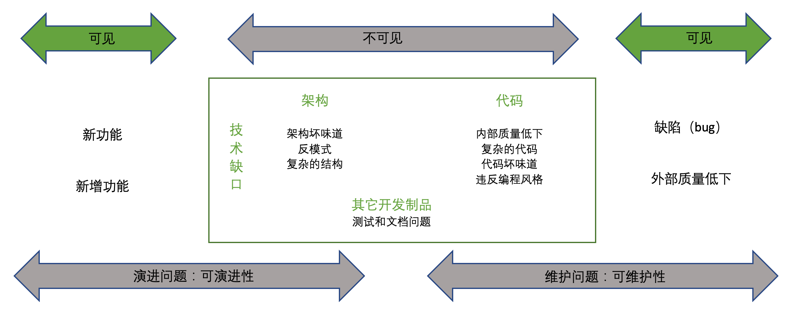

技术债对于软件的影响：可维护性（Maintainability）、可演进性（Evolvability），而这些技术债对于非技术人员来说都是不可见的。它们源于生活，藏于黑暗中。

#### 技术债风暴

在重构开始之前，我们可以进行技术债的头脑风暴，收集每个开发人员每迫切解决的技术痛点。并按照优先级来评估这些技术债，列入我们的重构范围中。

如我的同事在《[技术债治理的四条原则](https://insights.thoughtworks.cn/managing-technical-debt/)》 一文中所介绍的，我们可以在对应的限界上下文里，可视化技术债：

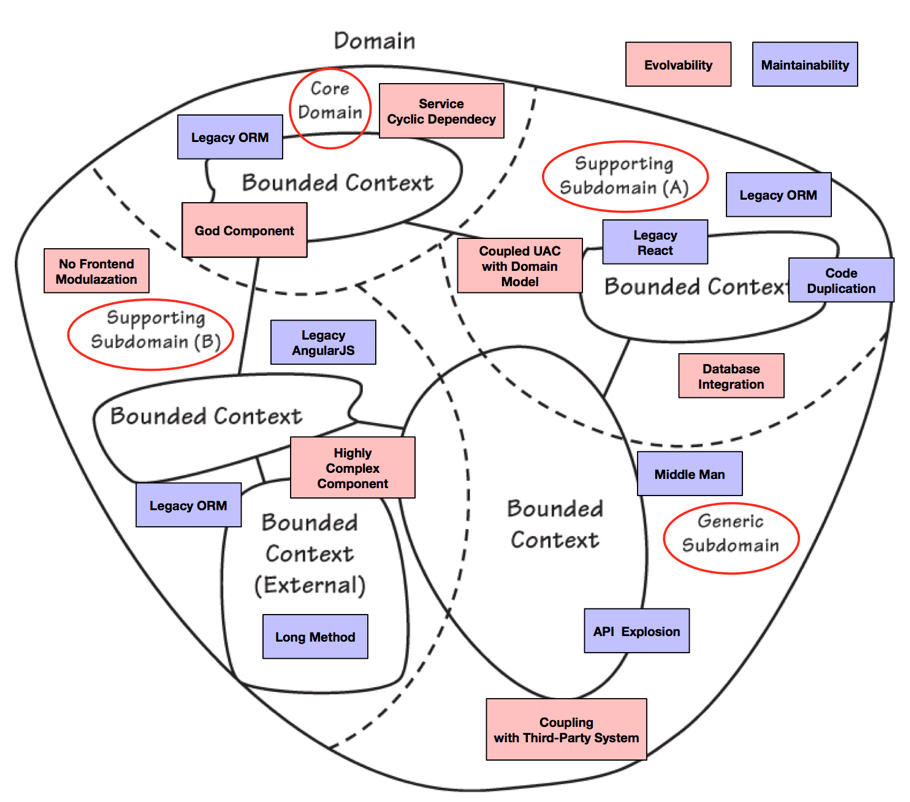

再根据 “核心领域优于其他子域” 的原则，及其严重程度，来划分出技术债的优先级。

#### 架构评估：技术驱动 vs 业务驱动

如我在那篇 《[分层架构重构](https://www.phodal.com/blog/refactor-mvc-architecture-to-ddd/)》 中所说，在大量的现有系统中，我们发现了 MVC 架构模式被落地为三层分层架构（controller-service-model）。开发人员对它们的错误等同，导致了架构上的一系列错误。

对于简单的系统来说，CSM 的包结构问题不大。或者说，对于非常简单的系统来说，大泥球架构也没有问题。我们所针对的是那些中大规模的系统。在这些系统里，系统并非一次性的，开发出来就不再维护了。因此，它们需要对更合适的架构设计和包的拆分分。

借助于 [Tequila](https://github.com/newlee/tequila) 这样的架构可视化工具，又或者是 `coca arch`，便可以得到项目的调用关系图，它可以在某种层面上反应出系统的架构。根据它，我们可以知道：

 - 项目的结构划分是否合理
 - 查看项目的代码中是否存在循环依赖的情况

结果如下图所示：

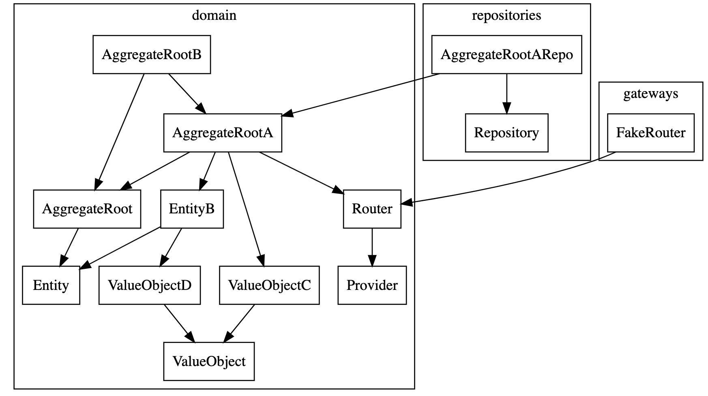

通过调用关系图，我们也可以查看类之间、包之间是否存在相互依赖。

#### 代码评估：收集 bad smell

对于这部分内容来说，你可以直接采用成熟的商业工具，如 SonarQube 便可以完成这方面的工作。

你也可以通过 `coca bs` 来做一些简单的 Bad Smell 收集：

```json
{
   "dataClass": [
      {
         "File": "examples/api/BookController.java",
         "BS": "dataClass"
      }
   ],
   "lazyElement": [
      {
         "File": "examples/api/model/BookRepresentaion.java",
         "BS": "lazyElement"
      }
   ]
}
```

而后，再生成对应的重构建议。

#### 收集 Todo 

代码中的 Todo 注释，是一些本应该发生的事情，本应该做好，但是我没有立即去做。换句话来说，Todo 都是项目中的技术债务，就了可能就永远不会做。

所以，我们需要有工具来查找项目的 Todo，如笔者编写的 Coca，可以寻找代码中的 Todo，包含其对应的日期、作者、提交信息、文件名及对其的行数等信息：

|            MESSAGES            |                                       FILENAME                                       | LINE |
|--------------------------------|--------------------------------------------------------------------------------------|------|
 happens on macosx, don't know why | .../ContributedLibraryTableCellJPanel.java |  118
 Make this a method of Theme    | .../ContributedLibraryTableCellJPanel.java |  233
 Do a better job in refreshing  only the needed element | .../LibraryManagerUI.java                  |  241
 Do a better job in refreshing  only the needed element  | .../LibraryManagerUI.java                  |  273
 Make this a method of Theme    |.../MultiLibraryInstallDialog.java         |  149
 happens on macosx, don't know  why  | .../ContributedPlatformTableCellJPanel.java |  183
 show error error when importing. ignoring  :(   | .../Base.java                                                     | 2423
 Improve / move error handling  |.../Editor.java                                                   | 1541
 Should be a Theme value?       |.../EditorHeader.java                                             |   78
 Should be a Theme value?       |.../EditorStatus.java                                             |   73
 Improve decoupling             | .../EditorTab.java                                                |  465

随后，我们只需要根据真实的情况，更新项目中的 Todo，以确认出我们需要完成的技术债务。

不过，写好一个 Todo 并不是容易，万一以后大家都不写了呢？

#### 测试和文档评估

关于测试的话题，我们会有一个大的专题来介绍相关的活动。

至于文档的缺乏，会在文中的最后介绍。

不过，你也可以参考我的那篇《[构建质量可信的软件系统](https://www.phodal.com/blog/build-trusted-software-system/)》 来对你的文档进行评估。

### 项目评估

根据不同的项目，侧重点有所不同。

但是毫无疑问地，我们可以统计：

 - 功能的 bug 率，对应的 bug 修改时间
 - bug 常见的问题
 - ……

你都懂的。我暂时就不 copy 了。

### 编写工具评估

在我遇到的一个重构项目中，项目中经常抛出Null Pointer Exception的问题。于是，我便写了一个简单的工具，来查找项目中返回Null Pointer Exception的代码，并对调用的地方进行评估。

随着评估的进一步深入，我在工具中加入了更多的功能，如：

 - 静态方法多，难以进行测试。要么是工具类过多，需要抽取基础设施；要么就是缺乏 OO 设计，导致过程性代码……。
 - Util 过多，同上。
 - Null Pointer Exception越多，则项目的出错可能性越多。
 - 类方法数的标准差，能判断出对应的上帝类情况。
 - 方法长度的标准差，越大则意味着方法的长度都比较长，方便于重构。

只需要运行 `coca evaluate`，就能得到以下的结果：

|              TYPE              | COUNT |         LEVEL         | TOTAL |   RATE    |
|--------------------------------|-------|-----------------------|-------|-----------|
| Nullable / Return Null         |     0 | Method                |  1615 | 0.00%     |
| Utils                          |     7 | Class                 |   252 | 2.78%     |
| Static Method                  |     0 | Method                |  1615 | 0.43%     |
| Average Method Num.            |  1615 | Method/Class          |   252 |  6.408730 |
| Method Num. Std Dev / 标准差   |  1615 | Class                 | -     |  7.344917 |
| Average Method Length          | 13654 | Without Getter/Setter |  1100 | 12.412727 |
| Method Length Std Dev / 标准差 |  1615 | Method                | -     | 20.047092 |

笑，你只要加强使用 TDD，那么上述的大部分问题，都能得到进一步的缓解。

### 代码评估工具

Java 世界流行的几个找问题工具：

 - FindBugs/SpotBugs
 - PMD/CPD
 - Checkstyle

试试你就知道了。

### 真实的测试覆盖率

尽管有越来越多的项目将测试覆盖率作为一项考核指标。但是，对于诸多编程实践本身就好的公司为说，测试覆盖率也往往不是真的。

我们编写测试的其中一个目的是用于快速反馈，即当我们的功能出现问题的时候，我们可以快速通过测试来定位到问题所。然而，如果那些是没有断言的测试，那么我们就无法通过它来进行快速反馈。即，如果我们重构过程中，修改了某一块的功能，可能会进一步导致出现 bug。

为此，你可以借助于 Coca 的 Test Bad Smell 功能，来找到对应的问题。只需要执行 `coca tbs`，便能帮助你找到代码中的坏味道。它可以在你进入重构之前，帮你看看是否有对应的风险。

如下是 Coca 扫描出来的 Arduino 开源项目测试问题：

|        TYPE         |                           FILENAME                            | LINE |
|---------------------|---------------------------------------------------------------|------|
| DuplicateAssertTest | app/test/cc/arduino/i18n/ExternalProcessOutputParserTest.java |  107 |
| DuplicateAssertTest | app/test/cc/arduino/i18n/ExternalProcessOutputParserTest.java |   41 |
| DuplicateAssertTest | app/test/cc/arduino/i18n/ExternalProcessOutputParserTest.java |   63 |
| RedundantPrintTest  | app/test/cc/arduino/i18n/I18NTest.java                        |   71 |
| RedundantPrintTest  | app/test/cc/arduino/i18n/I18NTest.java                        |   72 |
| RedundantPrintTest  | app/test/cc/arduino/i18n/I18NTest.java                        |   77 |
| DuplicateAssertTest | app/test/cc/arduino/net/PACSupportMethodsTest.java            |   19 |
| DuplicateAssertTest | app/test/processing/app/macosx/SystemProfilerParserTest.java  |   51 |
| DuplicateAssertTest | app/test/processing/app/syntax/PdeKeywordsTest.java           |   41 |
| DuplicateAssertTest | app/test/processing/app/tools/ZipDeflaterTest.java            |   57 |
| DuplicateAssertTest | app/test/processing/app/tools/ZipDeflaterTest.java            |   83 |
| DuplicateAssertTest | app/test/processing/app/tools/ZipDeflaterTest.java            |  109 |

好在上述的测试代码中，没有出现诸如于下面场景的测试坏味道：

  - EmptyTest。测试函数里空空如也
  - UnknownTest。测试中没有对应的断言
  - IgnoreTest。测试是被 Ingore 的，即不会运行的测试。

如果你的代码中出现了大量的上述问题，你需要好好反思一下，你的测试覆盖率是真实的吗？

### 可测试性评估

代码本身是缺乏测试的，那么它就是一个遗留系统。

### 度量

根据《精益软件度量》对于度量的定义：

 - 度量在组织上下文中形成的一系列共识
 - 将经验性模型转换为向量化模型（修改）
 - 包含人、流程、组织和工具的一个动态系统

TBD

#### 度量缺陷

### 寻找专业人士

你懂的。

## 重构准入条件

看标题就够了。

### 工具准备

### 重构看板

### 版本控制

### 自动化重构工具

### 持续集成环境

### 记录

## 探索性重构：可行方案

我喜欢重构的那种感觉 —— 把一坨烂代码，驯服成更易于阅读的代码。

### 准备知识：坏味道的模式

软件开发是一种团队活动，当组织**缺乏强有力的**新鲜血液时，代码便会以相同的模式编写。该组织设计出来的架构，也从某种意义上出现了大量的趋同 —— 创新反而可能不好。在这种统一的模式之下，组织的代码也会呈现相似的坏味道。代码中的坏味道的模式也往往极为相似。

也因此，我们能快速地通过一小部分代码，了解整个项目的情况。

为此，我们只需要根据《重构：改善既有代码的设计》一书提出的 23 种代码坏味道，整理出系统中的常见坏味道。

| 集合类型  | 坏味道 |
|---------|---------------|
| 代码臃肿 | 过长函数，过大的类，基本类型偏执，过长参数列，数据泥团 |
| 滥用面向对象 | Switch 声明，临时字段，被拒绝的遗赠，异曲同工的类 |
| 变革的障碍  |发散式变化，霰弹式修改，平行继承体系 |
| 非必要的    | 冗余类，纯稚的数据类，重复代码，夸夸其谈的未来性，注释 |
| 耦合       | 不完美的类库，依恋情结，狎昵关系，消息链，中间人 |

随后，我们便能有针对性地对代码进行重构。

#### C4 模型

C4 Model 是一个非常不错的架构可视化工具，它从系统 System、容器 Container、组件 Component 和代码 Code 四个层次，由顶至底来介绍系统的架构：

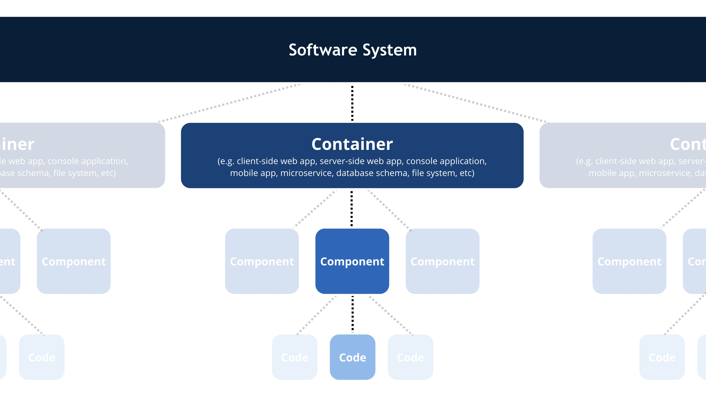

所以，我们可以根据 C4 模型的思路来查看整个应用的架构设计和代码情况。

### 探索模式

#### 1. 从分层架构到具体代码

 - 代码库间关系
 - 代码库内模块化结构
 - 模块化包结构
 - 包内代码结构

#### 2. 从外部适配器到内部适配器

举个例子，从 API 入手：

 - Controller
 - Service
 - Model
 - DAO

#### 3. 查看测试情况

 - 是否包含单元测试
 - 是否包含集成测试
 - 测试覆盖率情况
 - 测试编写情况

#### 4. 针对于最复杂的情形和最简单的情形

1.  从最简单的场景出发，对常规流程、包间关系有一定的了解
2.  从复杂的场景收尾，看最复杂的场景下会有什么问题
3.  根据需要寻找一个适合的场景，

#### 工具：API 列表和调用关系

针对于那些使用 Spring 框架的后端项目来说，可以尝试使用 `coca api` 来生成项目 API 调用图。

### 构建领域知识

作为一个碳基生物，我们要承认我们并非是全知的。我们所能做的事，来到一个新的领域时，能快速学习相关的知识。

#### 了解业务架构 

> 高水平的软件架构师不仅要懂技术，还要掌握问题空间对应的业务领域知识。—— 《软件架构师应该知道的 97 件事》

#### 架构全景

简单来说，就是你知道对系统有一个初步的认知，它包含了：业务架构、技术架构、开发组成等等。

#### 领域名词表

根据开发人员介绍的各种概念，抽象出一份系统的领域名词表。它的来源是：

 - 项目的相关开发文档
 - 项目中的架构资源
 - 项目的代码
 - ……

也因此，当你需要到一个新的项目实施重构计划时，一定需要有一个能与你结对编程的人。一个领域专家，一个代码专家，双方的无间配合，才能快速落地完成重构工作。

我们所要做的一个努力是，让文档、架构、元模型概念与代码实现一一对齐。这并不是一件容易的事情。从大多数项目的实践来看，架构师的设计和模型的实现往往是脱离的。因为设计架构的人和实现模型的人，往往不是同一些人。

我正在尝试根据它来编写这样的一个功能，但是它不是一件容易的事。只是呢，已经有一个小的雏形，通过 `coca concept` 从函数名称中抽取出部分的对应模式

|    WORDS    | COUNTS |
|-------------|---------|
| blog        |     15 |
| publish     |      7 |
| entity      |      6 |
| domain      |      5 |
| published   |      5 |
| resource    |      4 |
| criteria    |      4 |

但是，这只能是构建领域名词表的一个 hello, world，并不足以承担起真正的领域名词活动，也无法构建真正的领域名词表体系。

除此，我还在寻找一种更高效的构建领域特定语言方式，它用于帮助我们高效地进行软件开发，这种社会学活动。


### 寻找高引用 + 高修改

经常修改的代码，并不是见得是件好事。我们可以从中看到一些代码的坏味道，把它朝合适的方便引进，如类库，如包内聚等等

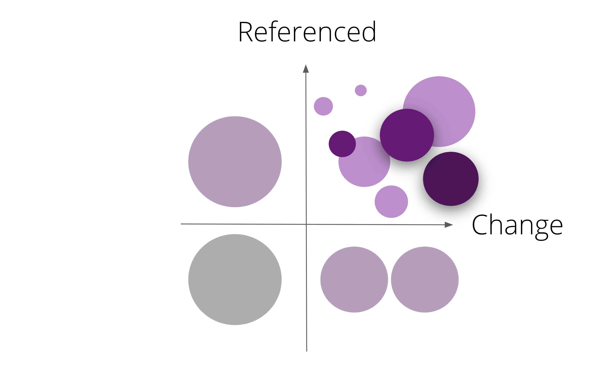

如果你使用的是 Git，可以通过 `coca git -t` 识别到高修改的文件：

|                                                     ENTITYNAME                                                      | REVSCOUNT | AUTHORCOUNT |
|---------------------------------------------------------------------------------------------------------------------|-----------|-------------|
| build.gradle                                                                                                        |      1326 |          36 |
| src/asciidoc/index.adoc                                                                                             |       239 |          20 |
| build-spring-framework/resources/changelog.txt                                                                      |       187 |          10 |
| spring-core/src/main/java/org/springframework/core/annotation/AnnotationUtils.java                                  |       170 |          10 |
| spring-beans/src/main/java/org/springframework/beans/factory/support/DefaultListableBeanFactory.java                |       159 |          15 |
| src/docs/asciidoc/web/webmvc.adoc                                                                                   |       121 |          24 |
| spring-context/src/main/java/org/springframework/context/annotation/ConfigurationClassParser.java                   |       118 |           9 |
| src/dist/changelog.txt                                                                                              |       118 |           9 |
| spring-webmvc/src/main/java/org/springframework/web/servlet/config/annotation/WebMvcConfigurationSupport.java       |       116 |          15 |


上述的代码是 Spring Framework 中最常修改的文件，前面三个文件看上去是合理的，但是 ``AnnotationUtils.java`` 显然有问题。

对应的 ``DefaultListableBeanFactory.java`` 也有 2000+ 行左右的规模。

从代码的行数和修改次数来看，它们都是上帝类，并且经常出现 Bug。

下表是 Spring 源码中引用最多的方法：

| REFS COUNT |                     METHOD                     |
|------------|------------------------------------------------|
|       2086 | org.springframework.util.Assert.notNull        |
|        952 | org.apache.commons.logging.Log.debug           |
|        773 | org.springframework.util.Assert.state          |
|        666 | org.apache.commons.logging.Log.isDebugEnabled  |
|        482 | org.apache.commons.logging.Log.trace           |
|        425 | org.springframework.util.StringUtils.hasText   |
|        398 | org.apache.commons.logging.LogFactory.getLog   |
|        392 | org.apache.commons.logging.Log.isTraceEnabled  |
|        268 | org.springframework.util.StringUtils.hasLength |
|        213 | org.springframework.util.Assert.isTrue         |

从代码上来看，还是 Util 方法被引用得最多。似乎我们仍然需要一个更可靠的算法，来保证被引用的正常度。

## 第一步：防护网

尽管对于某些部分的重构来说，我们只是移动一下代码的位置 —— 如分层架构的调整，它不需要我们编写对应的测试。但是呢，出于流程完整性的考虑，这一步步往往流程比较长，毕竟它可以减少系统中 bug 的出现，降低重构的风险。与此同时，这是可以由团队一起协作完成的工作，特别适合于多人的协同重构方式。

### 防护网策略

为了**保证对外暴露的 API 好的**，即我的重构不影响 API 的使用方，我们需要设计一个合适的防护策略。

在设计的时候，我们采用的是测试金字塔来帮助我们搭建测策略。我们会从下（单元测试）向上（集成测试）一步步搭建测试策略。

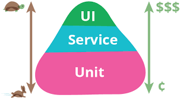

而当我们重构的时候，我们则是自顶向下设计防护策略。常见的测试策略有

 - 框架/模式库测试。xUnit，xMock，如 Java 语言里的 JUnit, Mockito；JavaScript 中的 Jest 
 - 端到端 API 测试。JMeter，Postman，Rest Assured，Karate
 - UI 集成测试。Protractor

考虑到测试即文档，在实现实现的时候，会配合一些支持自然语言描述的框架，如：

 - 文档式测试，Gauge （主流语言），Concordion（Java）
 - BDD 测试，Cucumber（主流语言）
 - ATDD 测试，Robot Framework（Python 语言）

为了与运行客户端一配合，我们还需要有底层 API 来控制浏览器、客户端应用：

  - Appium。移动 APP 和桌面应用，支持主流语言
  - Selenium。Web 浏览器，支持主流语言
  - Puppeteer。Node.js API 操作 Chrome 浏览器

关于 APP 测试方案，可以参考我之前写的《[【架构拾集】移动应用的自动化测试（BDD 方式）](https://www.phodal.com/blog/phodal-architecture-101-mobile-appllication-test-architecture/)》

根据现有的 E2E（端到端）/集成测试框架的架构，我画了一个大致的测试策略分层架构图：

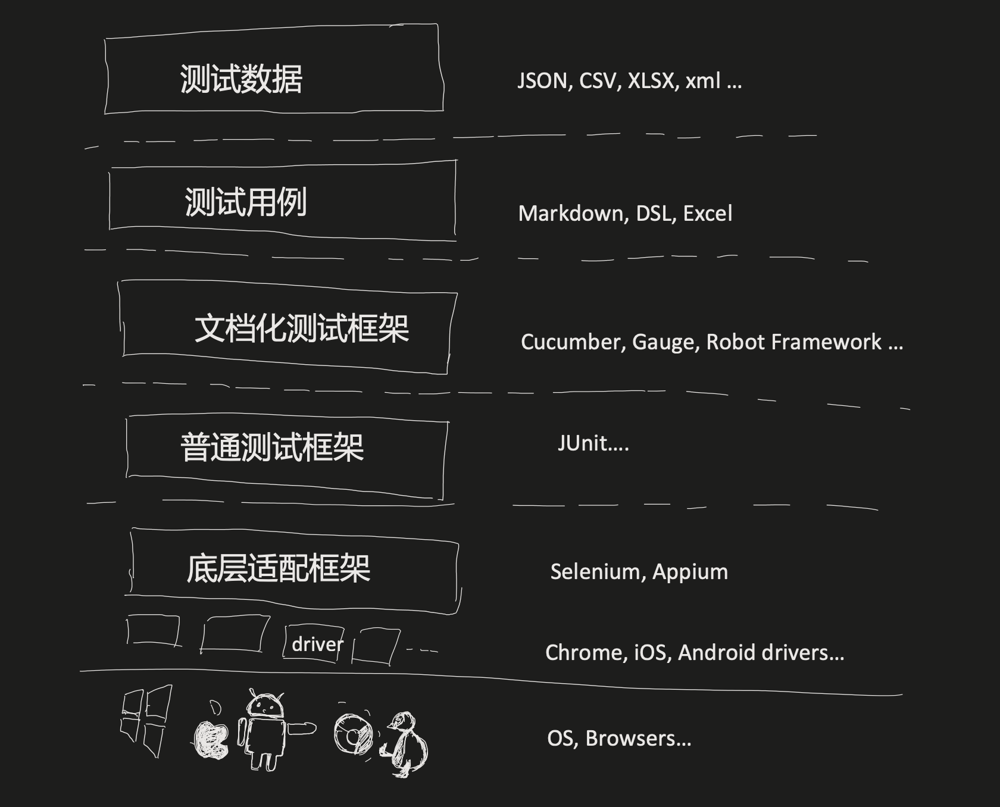

选择适合你们团队的测试架构，然后编写你的第一个测试。

### 第一个测试

这个就简单了：

1. 选择方案，然后 Google
2. 寻找最简单的情形，编写测试
3. 只需要有了第一个，剩下的就是时间问题。

Done！

### 持续集成重构

如果你还没有持续集成环境的话，那么请搭建它。

考虑到这是一个体力活，而且这方面的资料已经足够的多，我就不浪费大家的时间了。

顺带一提，如果你的分支比较多，而且构建比较多，那么你可以考虑 `pipeline as pipeline` 的方式进行构建。

### 检视测试

某次代码重构中，我发现代码的测试覆盖率很高，过程中出了一些错误，重构手法不正确是一个问题。但是在重构的过程中，发现有些测试都是没有意义的，所以这让我意思到在构建防护网的时候，有必要审视一遍测试，查找测试代码中的坏味道。

> 测试代码坏味道，是指单元测试代码中的不良编程实践（例如，测试用例的组织方式，实现方式以及彼此之间的交互方式），它们表明测试源代码中潜在的设计问题。

常见的测试坏味道有：

 - 空的测试。测试是生成的，但是没有内容。
 - 忽略的测试。即测试被 Ignore
 - 没有断言的测试。为了测试覆盖率而出现的测试
 - 多余的 Println。调试时留下的讯息。
 - 多重断言。每个测试函数只应该测试一个概念。
 - ……

有兴趣进一步了解的话，可以阅读《[测试代码的坏味道](https://www.phodal.com/blog/test-bad-smell/)》。

也可以 `coca tbs` 来查找测试中的坏味道：

|        TYPE         |                           FILENAME                            | LINE |
|---------------------|---------------------------------------------------------------|------|
| DuplicateAssertTest | app/test/cc/arduino/i18n/ExternalProcessOutputParserTest.java |  107 |
| DuplicateAssertTest | app/test/cc/arduino/i18n/ExternalProcessOutputParserTest.java |   41 |
| DuplicateAssertTest | app/test/cc/arduino/i18n/ExternalProcessOutputParserTest.java |   63 |
| RedundantPrintTest  | app/test/cc/arduino/i18n/I18NTest.java                        |   71 |
| RedundantPrintTest  | app/test/cc/arduino/i18n/I18NTest.java                        |   72 |
| RedundantPrintTest  | app/test/cc/arduino/i18n/I18NTest.java                        |   77 |
| DuplicateAssertTest | app/test/cc/arduino/net/PACSupportMethodsTest.java            |   19 |
| DuplicateAssertTest | app/test/processing/app/macosx/SystemProfilerParserTest.java  |   51 |
| DuplicateAssertTest | app/test/processing/app/syntax/PdeKeywordsTest.java           |   41 |
| DuplicateAssertTest | app/test/processing/app/tools/ZipDeflaterTest.java            |   57 |
| DuplicateAssertTest | app/test/processing/app/tools/ZipDeflaterTest.java            |   83 |
| DuplicateAssertTest | app/test/processing/app/tools/ZipDeflaterTest.java            |  109 |


## 系统架构重构

> 架构将大问题分解为容易处理的小问题。——《架构师修炼之道 》

重量级 DDD 更多的是结合现状 + 未来出发，更多的人参与，提供准确的信息。

轻量级 DDD 则是通过现状，只需要少数熟悉的人，没有完成一致的达成，通过**持续性赋能**改善模型。

产品线 / 业务线来说，并非每一个子系统都是核心域，也不会投入大量的人和精力在上面。特别是，当你在重构的时候，投入的人员和精力不足以实施一个合理的事件风暴，以完成对应的领域驱动设计活动。所以，我们只能尽可能完善系统的设计。

### 高质量级 DDD 重构：演进驱动的事件风暴

它意味着，重构时需要有：

1. 积极专注的团队参与
2. 复杂的场景
3. 领域专家参与协作
4. 迭代式的模型设计

为此需要：

1. 事件风暴
2. 识别上下文
3. 梳理上下文关系
4. 划分问题子域 
5. 识别弹性边界 
6. 领域建模
7. 分层架构 

对应的我们需要：

1. 重搭架构
2. 编写集成测试
3. 搬移代码
4. ……

考虑到其复杂性，我建议采用《事件风暴设计工作坊》来完成相关的流程。

### 轻量级 DDD 重构：现状驱动的领域方案

有意思的一个现象是，在真正落地的时候，对于核心的系统往往会抱着比较谨慎的态度 —— 除非原来的模式真的有问题。又或者是，所处的部门不是系统的核心部门时，在投入在会出现一定的问题。

看图：

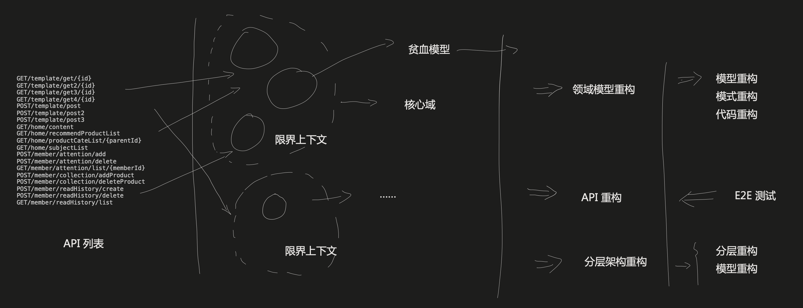

相应的步骤如下：

1. 结合工具识别所有的接口
2. 通过接口识别出领域名词（聚合、实体等）
3. 分析接口设计是否合理
4. 通过领域名词划分上下文边界
5. 重新定义领域名词
6. 结合领域名词划分新的 API
7. 划分领域和分层架构
8. 重新划分分层架构
9. 重构 service 代码，剥离领域逻辑
10. 重构代码到领域模型

对于未采用 Swagger 等 API 管理工具的项目，可以通过 `coca api` 生成 API 列表：

```
GET   /aliyun/oss/policy                
POST  /aliyun/osscallback               
GET   /subject/list                     
GET   /esProduct/search                 
GET   /order/list                       
GET   /productAttribute/list/{cid}      
GET   /productCategory/list/{parentId}  
GET   /brand/list                       
GET   /esProduct/search/simple          
...
```

### 限界上下文要素

包含相关上下文的：

 - 实体（entity）。只要一个对象在生命周期中能够保持连续性，并且独立于它的属性（即使这些属性对系统用户非常重要），那它就是一个实体。它具有唯一标识和生命周期。
 - 值对象（value object）。当你只关心某个对象的属性时，该对象便可作为一个值对象。它是实体的附加业务概念，用来描述实体所包含的业务信息。 
 - 领域服务（domain service）。封装了没有在模型中自然建模为值对象或实体的领域逻辑和概念。它的主要职责是使用实现和值对象编排业务逻辑。
 - 领域事件（domain event）。它用于表明问题域中发生了一些业务人员关心的事情。在命名领域事件时，我们往往选择动词的过去分词，以明确表达事件的属性，其中文形式往往是『XXX已YYY』。
 - 资源库（repository）。公开聚合根在内存中的集合的接口，提供聚合根的检索和持久化需要。
 - 工厂（factory）。即在实体或者值对象创建复杂时，可以委托给工厂（模式）进行创建。。
 - 聚合（aggregate）。是一种边界内的领域对象的集群，可以将其视为一个单元。可以封装一个到多个实体与值对象，用来维护该边界范围之内的业务完整性。

### 微服务重构

一旦涉及到对微服务进行重构的时候，我们有很大的可能性要对系统进行 API 的重构设计。它也意味着，我们可能会影响到 API 的使用方，如果 API 也是自己内部的系统，那么问题就不是太大；如果 API 的使用方是第三方团队的系统时，我们就需要考虑一下兼容方案。这种兼容方案会在一定程度上影响到我们的重构，甚至于我们有可能不对做这方面的重构。

重构到微服务是一个巨大的挑战。

微服务是一个生态系统，它需要大量的基础设施进行配合，如部署管道、服务注册与发现、日志和监控、负载均衡等。

如果团队本身没有相关的经验，并且尝试往上调整的话，那么需要在心理上做好大量的准备。

如果你的目标是重构到微服务架构，那么我建议你先重构到 DDD + 整洁架构，它是微服务架构的一个中间态。即，先看看容器架构重构。

### …… 

待定。

由于笔者在这方面的经验不是非常丰富，但是我知道这里仍然有非常多的内容，可以探索。

欢迎大家来 pull request。

## 服务架构重构

**小步前进，拉一下最新的代码。**

我在设计之初，想把标题改为容器架构重构，它对应上 C4 模型。纠结之后，我还是改为了服务架构。可见，命名之难。

### 整洁架构

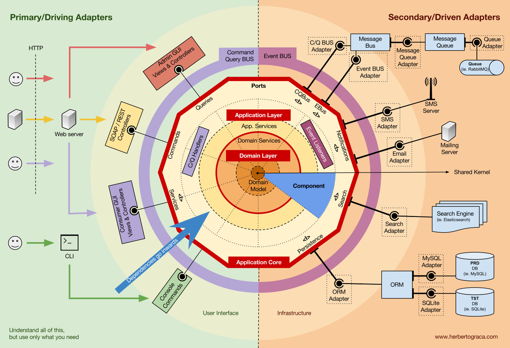

Robert C. Martin 总结了六边形架构（即端口与适配器架构）、DCI （Data-Context-Interactions，数据-场景-交互）架构、BCI（Boundary Control Entity，Boundary Control Entity）架构等多种架构，归纳出了这些架构的基本特点：

 - 框架无关性。系统不依赖于框架中的某个函数，框架只是一个工具，**系统不能适应于框架**。
 - 可被测试。业务逻辑脱离于 UI、数据库等外部元素进行测试。
 - UI 无关性。不需要修改系统的其它部分，就可以变更 UI，诸如由 Web 界面替换成 CLI。
 - 数据库无关性。业务逻辑与数据库之间需要进行解耦，我们可以随意切换 LocalStroage、IndexedDB、Web SQL。
 - 外部机构（agency）无关性。系统的业务逻辑，不需要知道其它外部接口，诸如安全、调度、代理等。

如图所示 Clean Architecture 一共分为四个环，四个层级。环与环之间，存在一个依赖关系原则：**源代码中的依赖关系，必须只指向同心圆的内层，即由低层机制指向高级策略**。其类似于 SOLID 中的依赖倒置原则：

 - 高层模块不应该依赖低层模块，两者都应该依赖其抽象
 - 抽象不应该依赖细节，细节应该依赖抽象

与此同时，四个环都存在各自核心的概念：

 - 实体 Entities （又称领域对象或业务对象，实体用于封装企业范围的业务规则）
 - 用例 Use Cases（交互器，用例是特定于应用的业务逻辑）
 - 接口适配器 Interface Adapters （接口适配器层的主要作用是转换数据）
 - 框架和驱动（Frameworks and Drivers），最外层由各种框架和工具组成，比如 Web 框架、数据库访问工具等
这个介绍可能有些简单，让我复制/粘贴一下更详细的解释：

**实体（Entities）**，实体用于封装企业范围的业务规则。实体可以是拥有方法的对象，也可以是数据结构和函数的集合。如果没有企业，只是单个应用，那么实体就是应用里的业务对象。这些对象封装了最通用和高层的业务规则，极少会受到外部变化的影响。任何操作层面的改动都不会影响到这一层。

**用例（Use Cases）**，用例是特定于应用的业务逻辑，一般用来完成用户的某个操作。用例协调数据流向或者流出实体层，并且在此过程中通过执行实体的业务规则来达成用例的目标。用例层的改动不会影响到内部的实体层，同时也不会受外层的改动影响，比如数据库、UI 和框架的变动。只有而且应当应用的操作发生变化的时候，用例层的代码才随之修改。

**接口适配器（Interface Adapters）**。接口适配器层的主要作用是转换数据，数据从最适合内部用例层和实体层的结构转换成适合外层（比如数据持久化框架）的结构。反之，来自于外部服务的数据也会在这层转换为内层需要的结构。

**框架和驱动（Frameworks and Drivers）**。最外层由各种框架和工具组成，比如 Web 框架、数据库访问工具等。通常在这层不需要写太多代码，大多是一些用来跟内层通信的胶水代码。这一层包含了所有实现细节，把实现细节锁定在这一层能够减少它们的改动对整个系统造成的伤害。

### 设计新架构

根据不同项目的实际情况，在真正落地的时候，会存在一些细微的差距。

如我的同事 [@huleTW](https://github.com/huleTW) 在 [django-ddd-demo](https://github.com/huleTW/django-ddd-demo) 项目中使用的 Python + Django 下的 DDD 分层架构如下所示：

 - **apis**：放各种 url 的 dispatcher
 - **application**：放各种 use case，use case 只能访问 domain 里面的 domain service
 - **domain**：放各个聚合，各个聚合里面有一个 domain service，domain service 操作可以聚合根，包含业务逻辑
 - **infrastructure**：放读取数据（服务，中间件），以及公共的 util 包

我的同事 [@howiehu](https://github.com/howiehu) 在 [DDD Architecture Samples](https://github.com/howiehu/ddd-architecture-samples) 项目中使用了整洁架构分层如下：

```
├── adapters      适配器
│   ├── inbound   入站适配器
│   └── outbound  出站适配器
├── application   应用层
│   ├── concepts
│   ├── dto
│   ├── gateway
│   └── usecases  用例
└── domain        领域层
    ├── contexts  限界上下文
    └── core      核心概念
```

因此对于整洁架构的外部适配器，人们通过有多种叫法 interfaces、apis、facades、presentation、adapters 等等，

而诸如 application、domain 和 infrastructure 来说，命名上倒是没有太大的区别。但是在实现上还是有相当大的区别：

**粘合层（service）**。在 application 中的粘合层倒是有不同的叫法 service（application service）、usecases、interactors。但是在真正实施的时候，还会有巨大的差别，采用 service 可能会出现上帝类，于是就出现用例驱动的 xxxUsecase。

**瘦 application vs 胖 application**。采用 PresentationDomainDataLayering 架构，即瘦 application 层，会把用例放在 domain 中；而采用胖 application 架构，则会把 usecase 放在 application 中。两者的使用场景的区别，主要取决于 CRUD 的**纯净度**。如果你有 BFF，那么瘦 application 层适合于你；如果你是单体，又或者是跨实体操作多，那么胖 application 层适合你。

不过，这些都不重要，重要的是要不要出现尖叫架构 —— 一看就懂得业务：

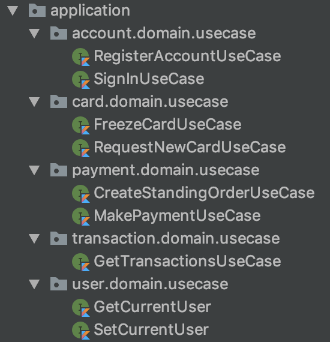

你只需要回答一个问题，你的场景复杂吗？复杂的话，你就拆 —— 将复杂问题繁杂化。

### 实施新分层架构

实施新分层架构是一个持续的过程，它需要配合后续的各种重构模式。

#### 划分类，移动代码

这一步我们所做的是：移动旧的 service、controller、model 为竖直 + 水平架构。

对于大单体应用来说，从分层架构上，移到新的架构并不难：按各种层级创建应用，移动代码。

对于微服务架构应该来说，这一步也不算麻烦。

#### 技术模块化 => 重搭

对于原先模块划分不合理的应用来说，如：

```
├── pom.xml
├── zheng-api-common
│   └── pom.xml
├── zheng-api-rpc-api
│   └── pom.xml
├── zheng-api-rpc-service
│   └── pom.xml
└── zheng-api-server
    └── pom.xml
```

因为包、类之间本身是根据技术维度来划分的，如果我们计划以业务维度重新开发时，便就得创建新的目录结构，再移入新的类包。但是这样做的一个问题是，中间存在一个不可恢复的状态，会在一定程度上影响重构效果。

### 中间态分层

考虑到服务重构的难度，它会存在着一个长期的中间态分层架构。原因有很多：

 - 无法短期内重构完
 - 未拆到正确位置的 API
 - 领域层中的 repository 未拆分

所以，可以考虑将瘦 application 层作为中间态架构。

### 验收条件：构建

是的，在这一步里，由于只是移动文件，所以只需要执行一下构建，你就能验证移动文件是否正确。

不过，由于有 IDEA 这样的工具上，想必不是问题。

然而，要是代码库过于庞大，那么我建议你试试 `coca refactor`。

### 潜在问题

#### bean 注入

#### 解决冲突

#### 同步 API 修改

#### 对齐新分层架构

## 公共代码重构

**小步前进，拉一下最新的代码。**

> 创建通用的共享组件导致了一系列问题，比如耦合、协调难度和复杂度增加。

当我看到一个个巨大的 common 包时，我开始痛恨 `common`、`base`、`util` 这些该死的包，还有它们目录下统一管理的 `bean`。我们真的已经把它们用烂了，所以你应该重新审视一下你的项目代码。

所以，从这种意义上来说：**复用与低耦合**，本身存在一定的互斥关系。

公共代码往往缺乏抽象，又或者是追求过度的复用。

### 它真是个 util 吗？

> 哦，不，它是个恶魔，因为它是 util。

你会往 xxUtil 不加思索地扔入逻辑，正如你会往 common/bean 中扔入所有的 model，直次有一天，你拥有一个巨大无比的 base、common 代码。

大多数情况下，所有和业务相关的 Util 都存在一定的问题，如 CaptchaUtil，它要么应该划到自己的上下文中去，要么扔到诸如于 domain/shared 等共享上下文，而不是和其它 util 放到一起。

而诸如 FileUtil、DateUtil、RedisUtil、JdbcUtil 这些都可以说是基础设施相关的部分，它们可以划到 infrastructure/file 又或者是 infrastructure/date 目录下，而不是统一的管理这些 util。

如 [StackOverflow](https://stackoverflow.com/questions/1866794/naming-classes-how-to-avoid-calling-everything-a-whatevermanager) 的相关问题所列，我们还有诸如 Coordinator、Builder、Writer、Reader、Handler、Container、Protocol、Target、Converter、Controller、View、Factory、Entity、Bucket 等名称。

含义更加丰富的名字启示如下：

**XXX器[拟物化]：** 

| Listener 监听器        | Adapter 适配器   | Filter 过滤器         | Iterator 迭代器     | Buffer 缓冲器       | Connector 连接器           |
| ---------------------- | ---------------- | --------------------- | ------------------- | ------------------- | -------------------------- |
| Decortor 装饰器        | Iterepter 解释器 | Interceptor 拦截器    | Reactor 反应器      | Configurator 配置器 | Wrapper 包装器             |
| Proactor 主动器        | Monitor 监视器   | Controller 控制器     | Translator 转换器   | Acceptor 接收器     | Selector 选择器            |
| Container 容器         | Manager 管理器   | Evictor 驱逐器        | Activator 激活器    | Mapper映射器        | Locator 定位器             |
| Handler 处理器         | Assembler 汇编器 | Driver 驱动器         | Spliterator 分割器  | Builder 构建器      | Formatter 格式器           |
| Scanner  扫描器        | Timer 定时器     | Converter 转化器      | Dispatcher 分配器   | Multicaster 广播器  | Transfer 传输器            |
| Desriptor 描述器       | Encoder编码器    | Decoder 解码器        | Introspector 内省器 | Tokenizer 分词器    | Loader 加载器(ClassLoader) |
| Logger 记录器          | Parser 解析器    | Resolver 分解器       | Incrementer 增加器  | Counter 计数器      | Collector 收集器           |
| Initializer 初始化器   | Setter 设置器    | Getter 取值器         | Marshaller 编组器   | UnMarshaller 解组器 | Helper 帮助器              |
| Accessor 访问器        | Visitor 访问器   | Reflector 反射器      | Embedder 嵌入器     | Finalizer 回收器    | Specifier 标识器           |
| Supplier 供应器        | Processor 处理器 | Joiner 接合器         | Recorder 记录器     | Reducer 归集器      | Analyzer 分析器            |
| Invoker 调用器         | Provider 供应器  | Renderer 渲染器       | Holder 持有器       | Closer 关闭器       | Operator  操作器           |
| Appender 添加器        | Printer 打印器   | Tuplizer 元组器       | Caller 调用器       | Identifier 标识器   | Walker 漫步器              |
| Brower 浏览器          | Server 服务器    | Aggregator 聚合器     | Binder 绑定器       | Validator 校验器    | Finder 查找器              |
| Launcher 发射器/启动器 | Weaver 织入器    | Messenger 信差/消息器 | Extractor 提取器    | Sampler 取样器      | Profiler 优化器            |
| Tracer 追踪器          | Estimator 预估器 | Generator 生成器      | Instrumenter 插装器 | Viewer 查看器       | Debugger 调试器            |
| Analyser 分析器        | Inspector 检查器 | Linker 链接器         | Editor 编辑器       | Recognizer 识别器   | Decompiler 反编译器        |
| Translator 解释器      | Lexer 词法分析器 | Tracker 追踪器        | Constructor 构造器  | Destructor 析构器   | Executor 执行器            |
| Synchronizer 同步器    | Barrier 障碍器   | Allocator 分配器      | Bundler 打包器      | Applier 分发器      | Trigger 触发器             |


**XXX者[拟人化]：**

| Consumer消费者 | Producer 生产者 | Observer 观察者 | Caller 调用者 | Supervisor 监管者 | Keeper 管理员(ZooKeeper) |
| -------------- | --------------- | --------------- | ------------- | ----------------- | ------------------------ |
| Wokrer 工作者  |                 |                 |               |                   |                          |

器和者的一些名字可以互换。比如Builder 可以是构建器，也可以是构建者。名字选择很多，但是不要过度封装，用最简单的概念表现更多的含义。


试着干掉 Utils ，你将收获更多的类，笑~。

Utils / Helper 多数是恶魔，无法满足单一职责和开闭原则。好的 OO 设计，大部分的类只表示一个事物，及其所有属性和操作。

1. 尽可能减少 Utils / Helper 类。好的 OO 设计，大部分的类只表示一个事物，及其所有属性和操作。
2. 如果使用一个 Utils 用于操作类，如 IList，那么它应该划到类中。除非该类不存在于当前的应用中。
3. Utils 中的方法应该是无状态的，比如没有 static 变量。
4. 如果有大量的 Utils 方法，应该把划分到类中，以便快速找到它们。

### 过度设计

好的设计是尽可能简单的，它最易于适应新的设计，并能跟随业务的变化而变化。

 - 开发人员：『这个功能是给未来准备的』
 - Tech Lead：未来是多久？一个月后？半年后？
 - 开发人员：……

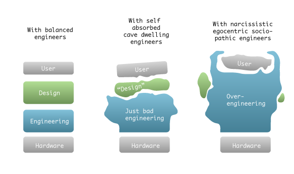

图片出自：https://stackoverflow.com/questions/1001120/what-is-over-engineering-as-applied-to-software

与之相对应的设计不足，则是因为经验的缘故。

### 重新定义：消除二义性

当我们谈论 service 的时候，我们谈论的是同一个 service 吗？

当我们谈论 model 的时候，我们谈论的是同一种 model 吗？

> 若对于一个文法的某一句子存在两棵不同的语法树，则该文法是二义性文法。

如果有多种不同类型的类，都被放置在 model 包下。那么，你应该消除 model 这个包，改为更表意的名称，如 Entity、Request、Response 等等。同理，一旦你们展开对某个名称的讨论时，是时候好好考虑其中的二义性。

最后，你还需要有一个相关领域的名词表。

避免产生二异性的词语。

### 类进行内聚

参考下文中的模型重构。

### 划分技术部分

如 Spring 框架的源码：

```
└── springframework
    ├── cache
    │   ├── annotation
    │   ├── concurrent
    │   ├── config
    │   ├── interceptor
    │   └── support
    ├── context
    │   ├── annotation
    │   ├── config
    │   ├── event
    │   ├── expression
    │   ├── i18n
    │   ├── index
    │   ├── support
    │   └── weaving
```


### 划分业务部分

业务模块中的技术部分。

#### 职责少 => 平级

```
└── orm
    ├── context
    ├── support
```

#### 业务代码多 => 再按业务拆分

```
infrastructure
└── repository
    ├── context
    │   ├── blog
    │   ├── advert
    │   └── pages
    ├── kafka
```

## 模块重构

**小步前进，拉一下最新的代码。**

> 模块/组件是软件的部署单元，是整个软件系统在部署过程中可以**独立部署**的最小实体。 —— 《架构整洁之道》

### 组件聚合三原则

在我们设计软件工程的时候，我们

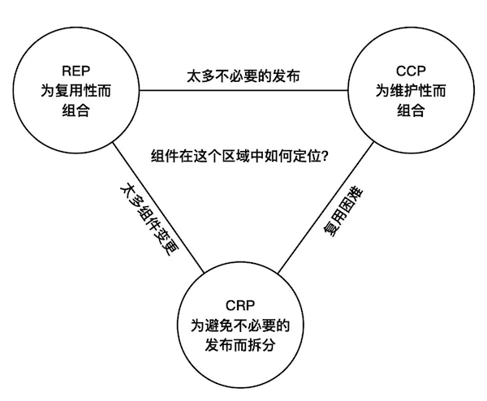

Bob 大叔在书中提到了三个原则：

 - 复用/发布等同原则（REP）。软件复用的最小粒度等同于其发布的最小粒度。
 - 共同闭包原则（CCP）。我们应该将那些会同时修改，并且为相同目的而修改的类放到同一个组件中，而将不会同时修改，并且不会为了相同目的而修改的那些类放到不同组件中。
 - 共同复用原则（CRP）。不要强迫一个组件的用户依赖他们不需要的东西。

不过，其实按我的理解，第一条原则讲的是合理、有效的包发布策略；而后两条原则，只需要满足我们的模块/包满足开闭原则、单一职责，就可以合理地解决整个流程了。不过，这三个原则可以合理地解释在软件生命周期中，我们应该如何管理模块。

因此，对于自家的模块只需要：**根据技术、业务划分包，形成上下文边界，防止代码越界**。

### 打破包之间的依赖关系

这一步理论上来看，倒也是蛮简单的：

1. 从 Gradle / Maven 找到想去除的依赖
2. 全局搜索依赖的包名
3. 解决依赖
   - 提取到类库中
   - 剥离并使用依赖注入
4. 删除依赖的包
5. 执行构建和 E2E 测试

TBC。工具还在写，目前主要要看人眼识别。

### 依赖倒置

为此，我们可能需要寻找一些合适的依赖注入框架：

 - Java。Spring，Dagger 2，Guice 等等
 - Go。Facebook  Inject、Uber Dig、Google Wire 等

对了，静态语言呢？

 - 不需要。

#### 更好的面向对象

事实上，如果我们把面向对象做好的话，那么对应的逻辑就会封装到相应的对象中。

### 清理垃圾代码

未使用的类，未使用方法。

它根本不知道什么时候会使用到，又或者是它已经通过多态来实现。

## 模型重构

**小步前进，拉一下最新的代码。**

> 架构元模型定义了模型中使用的概念和使用规则。 —— 《架构师修炼之道》

你可以将其对比于领域模型。

### 聚合行为

对于领域模型来说，我们也无法直接在代码中实现架构元模型的所有概念。但是，我们所要做的事不断减少模型与代码之间的差异。如果我们不创建模式，而直接开始编写代码，那么我们会收获一堆上帝类。但是，反过来，当我们有一堆上帝类的时候，那么我们就需要从类中把行为都抽取出来。

当我们的贫血模型，拥有了行为，就可以进一步构成富血模型，符合面向对象（OO）的思想。进一步的，我们可以从业务的角度来考虑这个问题，将充血模型改为领域模型。

#### 由内到外剥离，由外到内聚合

对于那些已经采用 DDD 架构的项目来说，往往会遇到一些领域模型不完整、包含非领域相关代码等的情况。

遇到这种情况时，可以尝试：

1. 由内到外剥离非模型相关代码。只需要浏览一遍领域模型相关的代码，然后剥离不属于模型的代码；通过依赖注入、工厂模式等方式，建立整洁的 domain 层。
2. 由外到内聚合领域模型相关逻辑。这是一个复杂的过程，需要每个使用到模型的调用方，再看是属于领域相关的行为。

第一步可以在短期内快速实现，而第二步则需要一个漫长的过长 —— 取决于项目的大小。

#### 识别模式 1：输入参数

你懂的

#### 识别模式 2：返回参数

你懂的

#### 优化创建

笔者在某个重构项目中，遇到模型的创建逻辑很复杂 —— 参数多、场景多，所以做的第一件事情是：使用工厂模式优化了创建过程。

参考工厂模式。

### 重命名：统一语言

在 DDD 中强调了统一语言的重要性，为此我们有必要对代码中的模型名称及其行为进行检视。在软件工程实践不好的团队中，你往往会出现**对于同一个事件，往往会有多种命名方式**。哪怕你觉得它是不正确的，因为 ownership 的缺乏，也没有人来统一对应的命名。

所以，在我们决定继续往下走之前，先学习一下怎么命名。

> 计算机科学只存在两个难题：缓存失效和命名。 —— Phil KarIton

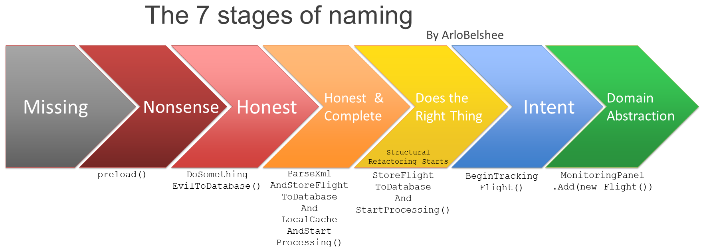

原文链接：[naming is a process](https://www.digdeeproots.com/articles/on/naming-as-a-process/)

但是还是更习惯于原来的文章中的：

| 阶段 | 解释 |   示例 |
|-----|------|------|
| 空白 | 没有名称 | doSomething() |
| 凑合 | 名称不能准确反应元素的含义| preload() |
| 沾边 | 名称至少反映了元素某一方面的功能 | DomSomethingEvilToDB() |
| 反映功能 | 名称直接描述了元素的所有功能 | ParseXmlAndStoreFightToDbAndLocalCacheAndStartProcessing() |
| 反映角色 | 名称充分地反映了元素在架构中的角色 | StoreFightlightToDatabaseAndStartProcessing |
| 反映意图 | 名称不仅反映元素的功能，还能反映其目的。 | BeginTrackingFlight() |
| 领域抽象 | 名称超越了单个元素本身，成为一个新的抽象概念。 | MonitoringPanle.Add(new Flight()) |

偶然间，我看到我找到我书架上的《重构与模式》时，刚好看到一本《实现模式》，顺便看了看，发现书的内容对于本文有启发意义。

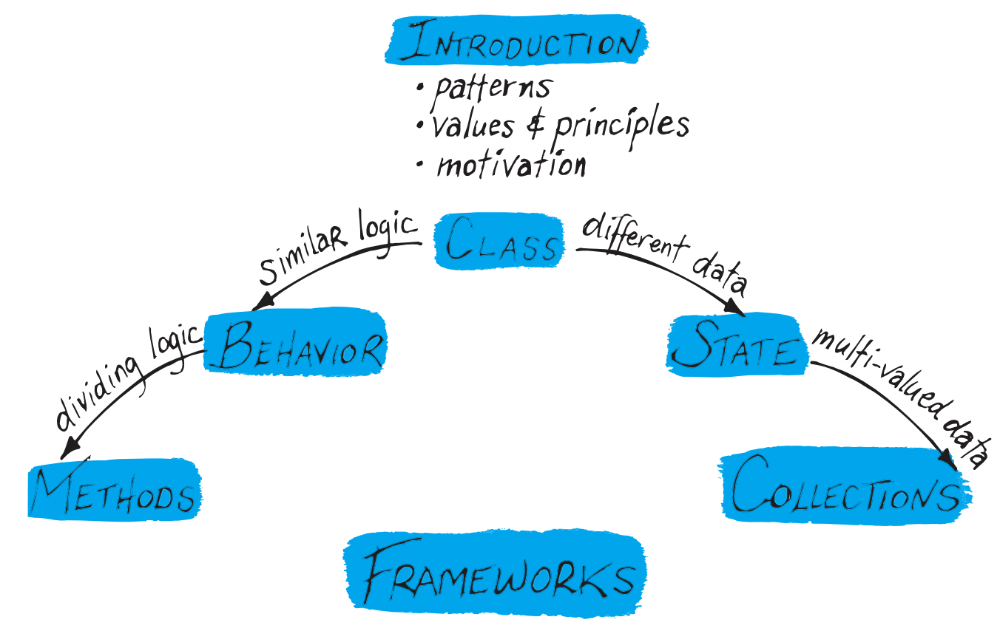

书中提及了四五种类型类、状态、消息与流（原行为）、方法，但是对于我们的统一语言工作来说，只需要重命名类、方法、状态就够了。

对应的解释如下：

#### 类

> 数据的变化比逻辑要繁琐得多，正是这种现象让类有了存在的意义。—— 《实现模式》

对于继承的类来说，它应该遵循这么一些原则：

 - 超类名称要简单
 - 子类名称要合格

#### 状态

状态包含了变量、字段、常量、局部参数、参数、参数对象等等。

#### 方法

> 在命名类和操作时要描述它们的效果和目的，而不要表露它们是通过何种方式达到目。 —— Eric Evans

#### 容器

### 离心分离模型：消除二义性

接下来就是处理剩下的 bean、model 等等模型。

在一个系统中，你会存在这么一些不同的 model：

（PS：部分描述可能不准确，欢迎指正）

*   与数据库表结构对应的 DO（ Data Object）/ PO(Persistant Object)。
*   查询数据的 Query、Request。
*   对外传输的对象：DTO（ Data Transfer Object）。
*   业务层之间的数据对象：VO（Value Object） / BO（Business Object)。
*   访问数据库的：DAO (Data Access Object数据访问对象)。
*   以及我们想要的 DDD 中的实体 Entity
*   还有其它的 POJO（ Plain Ordinary Java Object）

但是它们都是 model，所以它们都被扔到 model 中……，又或者是 bean 中……。导致，你有了一个巨大比的 model 层。

所以，在 DDD 又或者是 Clean Architecture，我们重新命名了不同的模式：

*   使用 Command / Request 作为输入参数。其中的 Command 模式在完成后需要发出对应的 Event。
*   使用 Response / DTO / Representation 作为返回结果。
*   对 Entity 大家保持了一致的意见
*   还有 PO / DO 作为作为数据库的存储模型
*   DAO 作为数据库的访问模型
*   ……

不过，其实你只要不再让使用 model 和 bean，相信会有更多地收获。

### 提取参数对象

如果一个类包含大量的参数，并且参数中存在一些相似的情形。对于概念统一的情况，可以提取成参数对象。

### 处理过程逻辑

过程不应该模型的一部分，但是它是领域的一部分。

如 Eric Evans 在所说，区分是否显式表达概念的关键在于：过程是否经常被领域专家谈起，又或者只是计算机程序机制的一部分。

这时候，我们就需要规格（Specification）模式。

### 领域特定语言

## 模式重构

> 模式是某种场合下对某个问题的一个解决方案的**一种结构化展现**。 ——  Jon Vlissides（GoF 成员）《设计模式沉思录》

**小步前进，拉一下最新的代码。**

不过，人们对于设计模式的看法就变成了砒霜，听上去有害，实际上真香。

我不是想鼓励使用设计模式，只是呢，如开头所说，我想展示的是如何用它来提升代码的可读性。也因此，我们的第一个例子是，干掉反模式的设计模式。

一旦你决定使用某种设计模式的时候，请确保**团队的所有人知道它解决了什么问题？**

### 终止 Singleton

> 确保一个类只有一个实例，并提供一个全局访问点来访问该实例。—— 《设计模式：可复用面向对象软件的基础》

单例对象存活的时间通常很长，它们通常存在于程序的整个生命周期中。一个复杂应用可能有很多个单例，会使得上述问题更加严重。

整体来说它的缺点大过优点：

1. 对单例类的依赖被硬编码到其他类中，对具体类的依赖性破坏了OO。
2. 单例对接口不友好。
3. 单例getInstance没有继承性。
4. 多线程情况下有线程安全问题。

### 工厂封装复杂构建

工厂是领域驱动设计中的重要组件。

工厂的目标：

1. 隐藏创建对象的复杂性
2. 减少对外暴露过多的内部结构

工厂模式是一种创建方法：

1. 工厂方法（factory method）
2. 抽象工厂（abstracty factory）
3. 建造者模式（builder）

值得注意的是：工厂并不总是需要独立的静态类。

尝试使用 `coca suggest` 会有惊喜。

#### 重构手法

对应的手法是：

1. 提取构建步骤到新的构建方法中
2. 将构建步骤方法转为 static 方法
3. 将这个 static 方法移到工厂类中
4. 将旧的构建函数提取成工厂方法
5. 将提取的工厂方法移到类中
6. 内联原有的工厂使用方

### 策略模式提供易变规则 

> 我们需要把过程中的易变部分提取到模型的一个单独的『策略』对象中，将规则与它控制的行为分开。——《领域驱动设计：软件核心复杂性应对之道》

看标题，你懂的。

### 建造者模式拆解复杂对象

看标题，你懂的。

### 工具：自动化识别

如 Coca 提供的 `coca suggest`功能，可以对相应的类提供一些建议，如：

| CLASS  |     PATTERN      |             REASON             |
|--------|------------------|--------------------------------|
| Insect | factory          | too many constructor           |
| Bee    | factory, builder | complex constructor, too many constructor, too many parameters |

## 代码重构

> 理想的方法长度不应该超过 4 行代码。—— Robert C Martin

常见的富血模型的类，往往包含了系统的行为。

常见贫血的原因是：

1. 缺乏抽象 
2. 过程代码
3. 行为无法附着
4. 未考虑复用

从技巧上来说，主要是**提取、内联与移动**，配合上 IDE 的重构功能和《重构：改善既有代码的设计》，那么剩下的事件就简单了。

如果你缺乏这方面的技巧，欢迎与我们联系。

### 降低圈复杂度

圈复杂度过大的代码，容易出问题。也因此呢，作为重构的第一步，只需要找一个工具，然后消除即可。

### 手法：提取

提取分为：

1. 提取参数 
2. 提取参数对象
3. 提取变量
4. 提取常量
5. 提取方法

### 手法：内联

内联上的手法则是：

1. 内联参数
2. 内联变量
3. 内联常量
4. 内联方法

### 手法：移动

移动的关键不在于

#### 方法移至其它类中

这里的 Ctrl + T 对应于老式的 IDEA 快捷键 Ctrl + Alt + Shift + T

1. 将函数转为静态方法，以解除对外的依赖（可选）（Static Method，Ctrl + T）
2. 将与函数职责无关的部分提取为函数的参数（Extract Functional Parameter，Ctrl + T）
3. 将函数的参数提取为参数对象（Extract Parameter Object，Ctrl + T）
4. 将函数移到参数对象中（Move Instance Method, F6）

完美。

### 标准：4 行的方法

偶然间在《修改代码的艺术：构建易维护代码的 9 条最佳实践》上看到了那句：『理想的方法长度不应该超过 4 行代码』。

所以，我找出了书架上的那本《代码整洁之道》，找到了出处 32 页。

> 函数不该有 100 行那么长，20 行封顶最佳。

然后就是 Kent Beck 的 Java/Swing 小程序四行的故事。

但是，要保持一个好的习惯，寻找合适的机会去重构它。


## 重构示例

我正在寻找一个合适的项目来演示如何重构。事实上，我已经找到了一些，但是它们的复杂度不太适合在线教学，所以我正在努力简化出一个可用的版本。

如果你已经迫不急待的话，可以尝试对以下的项目进行重构：

 - https://github.com/shuzheng/zheng
 - https://github.com/macrozheng/mall

它们是我在 GitHub 上找到的 Star 数相当多的开源 Java 项目，所以让我们来进行评估吧。

这两个项目的作者在项目中展示了极高的专业性和原则性。无论怎么说，这都是“好代码”，我也并非出于恶意的目的。如果你看了我在 GitHub 上的项目，你也会对我有诸多吐槽。我所尝试去做的是，以专业眼光来检视问题，不多也不少。作为一个追求匠艺的手工艺人，我们应该欢迎别人对我们这么做。只有批评才能让我们学到更多的东西。在进一步的重构之前，我们要再一次感谢两位作者将代码免费给社区的勇气和信心。他们做得相当的好。

相比之下，我大抵就只会复制和粘贴内容。

开始之前，你大可以从 GitHub 上复制这两个项目的其中一个，然后这里的例子以 mall 为例。你可以将 zheng 作为你的练手项目。

### 评估

这两个项目都有丰富的文档，足够让你搭建好它们的环境。事实上，我觉得你可能不需要这样的操作，你需要打开你的 Intellij IDEA，然后构建一下，就可以阅读代码了。

#### C4 模型展开

首先，让我们以 C4 模型来展开这个项目的代码。

**展开系统目录结构**。从目录结构上来看，mall 系统的组织相当的不错，按业务和通用模块进行了拆分。

```
├── mall-common -- 工具类及通用代码
├── mall-mbg -- MyBatisGenerator生成的数据库操作代码
├── mall-security -- SpringSecurity封装公用模块
├── mall-admin -- 后台商城管理系统接口
├── mall-search -- 基于Elasticsearch的商品搜索系统
├── mall-portal -- 前台商城系统接口
└── mall-demo -- 框架搭建时的测试代码
```

**展开其中的一个微服务**。这里以 mall 为例，这是典型的 controller-service-dao 架构：

```
mall-admin
├── bo
├── component
├── config
├── controller
├── dao
├── dto
├── service
└── validator
```

而其中的 `home` 包，又以

**展开包架构**。接着，让我们看看 controller 包下的目录结构，这是按技术划分服务的架构模式：

```
controller
...
├── SmsFlashPromotionController.java
├── SmsFlashPromotionProductRelationController.java
├── SmsFlashPromotionSessionController.java
├── SmsHomeAdvertiseController.java
├── SmsHomeBrandController.java
├── SmsHomeNewProductController.java
├── SmsHomeRecommendProductController.java
├── SmsHomeRecommendSubjectController.java
├── UmsAdminController.java
├── UmsMemberLevelController.java
├── UmsPermissionController.java
└── UmsRoleController.java
```

**展开类**。接着，让我们查看一下 OmsOrderReturnApplyController.java 文件，看看最后的接口：

```java
@ApiOperation("修改申请状态")
@RequestMapping(value = "/update/status/{id}", method = RequestMethod.POST)
@ResponseBody
public CommonResult updateStatus(@PathVariable Long id, @RequestBody OmsUpdateStatusParam statusParam) {
    int count = returnApplyService.updateStatus(id, statusParam);
    if (count > 0) {
        return CommonResult.success(count);
    }
    return CommonResult.failed();
}
````

用 OmsUpdateStatusParam 封装了请求参数，这个实践相当的不错。

接着，我们进入 `updateStatus` 方法看看：

```java
@Override
@Override
public int updateStatus(Long id, OmsUpdateStatusParam statusParam) {
    Integer status = statusParam.getStatus();
    OmsOrderReturnApply returnApply = new OmsOrderReturnApply();
    if(status.equals(1)){
        //确认退货
        returnApply.setId(id);
        returnApply.setStatus(1);
        returnApply.setReturnAmount(statusParam.getReturnAmount());
        returnApply.setCompanyAddressId(statusParam.getCompanyAddressId());
        returnApply.setHandleTime(new Date());
        returnApply.setHandleMan(statusParam.getHandleMan());
        returnApply.setHandleNote(statusParam.getHandleNote());
    }else if(status.equals(2)){
        //完成退货
        returnApply.setId(id);
        returnApply.setStatus(2);
        returnApply.setReceiveTime(new Date());
        returnApply.setReceiveMan(statusParam.getReceiveMan());
        returnApply.setReceiveNote(statusParam.getReceiveNote());
    }
		...
```

嗯，这是一个典型的贫血模型设计，这些业务逻辑都可以内聚到领域模型中。

所以，我们有了初步的结论，可以尝试的内容：

1. 典型三层架构。可以业务维度重新做分层架构 
2. 贫血模型。可以重构到充血模型

### 工具评估

现在，是时候拿出我的 Coca：https://github.com/phodal/coca

#### 代码统计

执行一下 `coca cloc` 可以看看项目的行数统计：

```
───────────────────────────────────────────────────────────────────────────────
Language                 Files     Lines   Blanks  Comments     Code Complexity
───────────────────────────────────────────────────────────────────────────────
Java                       471     80837    16265      2276    62296       1405
XML                        112     21710       61       119    21530          0
YAML                        12       430       36         8      386          0
Markdown                    10      1211      271         0      940          0
JSON                         8   1345664        0         0  1345664          0
gitignore                    6       119       15        17       87          0
Shell                        3        46        0         3       43          0
SVG                          2      6132        0       988     5144          0
License                      1       201       32         0      169          0
Properties File              1         4        0         0        4          0
SQL                          1      2192      143       440     1609          0
───────────────────────────────────────────────────────────────────────────────
Total                      627   1458546    16823      3851  1437872       1405
───────────────────────────────────────────────────────────────────────────────
Estimated Cost to Develop $55,872,945
Estimated Schedule Effort 70.766444 months
Estimated People Required 93.525243
───────────────────────────────────────────────────────────────────────────────
```

#### 基本情况评估

先执行一下 `coca analysis`，然后 `coca evalute`，得到一个基本的情况

|              TYPE              | COUNT |         LEVEL         | TOTAL |   RATE    |
|--------------------------------|-------|-----------------------|-------|-----------|
| Nullable / Return Null         |    21 | Method                | 13757 | 0.15%     |
| Utils                          |     2 | Class                 |   604 | 0.33%     |
| Static Method                  |     7 | Method                | 13757 | 0.01%     |
| Average Method Num.            | 13757 | Method/Class          |   604 | 22.776490 |
| Method Num. Std Dev / 标准差   | 13757 | Class                 | -     | 52.137890 |
| Average Method Length          | 46177 | Without Getter/Setter | 11218 |  4.116331 |
| Method Length Std Dev / 标准差 | 13757 | Method                | -     |  2.928149 |

从数据上看，静态方法只有 7 个，返回 null 的情况有 21 个，保持得不错。项目的平均方法长度也还行，就是平均方法有点多。

#### 代码坏味道评估

接着试试 `coca bs -s=type` 来查看代码中的常见坏味道，限于篇幅的原因这里就不复杂了，说主要问题：大的类一共有 72 个，其中 OmsOrderExample.java 类，在没有 set/get 的情况下有 576 个方法。查看了一下引用情况，好像是来看数据库查询用的……：

```java
public Criteria andProductSnLike(String value) {
    addCriterion("product_sn like", value, "productSn");
    return (Criteria) this;
}
```

这要重构的话是个体力活，详细见 [coca_reporter/bs.json](coca_reporter/bs.json)

#### 架构评估

执行了一下 `coca arch`，由于是扁平的三层架构，没有太多的问题。

#### API 评估

执行 `coca api -c -r com.macro.mall.` 获得基本的 API 列表情况：

| SIZE | METHOD |                      URI                       |                               CALLER                               |
|------|--------|------------------------------------------------|--------------------------------------------------------------------|
|    5 | GET    | /prefrenceArea/listAll                         | controller.CmsPrefrenceAreaController.listAll                      |
|    5 | GET    | /subject/listAll                               | controller.CmsSubjectController.listAll                            |
|   18 | GET    | /subject/list                                  | controller.CmsSubjectController.getList                            |
|   28 | POST   | /minio/upload                                  | controller.MinioController.upload                                  |
|   13 | POST   | /minio/delete                                  | controller.MinioController.delete                                  |
|    5 | GET    | /companyAddress/list                           | controller.OmsCompanyAddressController.list                        |
|   18 | GET    | /order/list                                    | controller.OmsOrderController.list                                 |
|   11 | POST   | /order/update/delivery                         | controller.OmsOrderController.delivery                             |
|   11 | POST   | /order/update/close                            | controller.OmsOrderController.close                                |
|   11 | POST   | /order/delete                                  | controller.OmsOrderController.delete                               |

这里的 size 指的是调用的方法里，这里的 MinioController 的 upload 方法里一共调用了 28 个方法，打开一看：

```java
@ApiOperation("文件上传")
@RequestMapping(value = "/upload", method = RequestMethod.POST)
@ResponseBody
public CommonResult upload(@RequestParam("file") MultipartFile file) {
    try {
        //创建一个MinIO的Java客户端
        MinioClient minioClient = new MinioClient(ENDPOINT, ACCESS_KEY, SECRET_KEY);
        boolean isExist = minioClient.bucketExists(BUCKET_NAME);
        ...
        minioClient.putObject(BUCKET_NAME, objectName, file.getInputStream(), file.getContentType());
        LOGGER.info("文件上传成功!");
        MinioUploadDto minioUploadDto = new MinioUploadDto();
        minioUploadDto.setName(filename);
        minioUploadDto.setUrl(ENDPOINT + "/" + BUCKET_NAME + "/" + objectName);
        return CommonResult.success(minioUploadDto);
    } catch (Exception e) {
        LOGGER.info("上传发生错误: {}！", e.getMessage());
    }
    return CommonResult.failed();
}
```

嗯，它可能需要一个 service，而考虑到 Minio 是一个云存储服务器，还需要通过接口来封装这些细节。

#### API 架构图

在生成 API 结果之后，可以打开 `coca_reporter/arch.svg` 查看项目的架构图。不过，由于项目的 API 较多，便需要一个个分析，所以你可以通过 `coca api -c -r com.macro.mall. -a /order` 查看 /order 的所有接口情况：

| SIZE | METHOD |             URI             |                             CALLER                              |
|------|--------|-----------------------------|-----------------------------------------------------------------|
|   17 | GET    | /order/list                 | controller.OmsOrderController.list                              |
|   11 | POST   | /order/update/delivery      | controller.OmsOrderController.delivery                          |
|   11 | POST   | /order/update/close         | controller.OmsOrderController.close                             |
|   11 | POST   | /order/delete               | controller.OmsOrderController.delete                            |
|    5 | GET    | /order/{id}                 | controller.OmsOrderController.detail                            |
|   11 | POST   | /order/update/receiverInfo  | controller.OmsOrderController.updateReceiverInfo                |
|   11 | POST   | /order/update/moneyInfo     | controller.OmsOrderController.updateReceiverInfo                |
|   11 | POST   | /order/update/note          | controller.OmsOrderController.updateNote                        |
|    5 | GET    | /orderSetting/{id}          | controller.OmsOrderSettingController.getItem                    |
|   11 | POST   | /orderSetting/update/{id}   | controller.OmsOrderSettingController.update                     |
|    5 | POST   | /order/generateConfirmOrder | portal.controller.OmsPortalOrderController.generateConfirmOrder |
|    2 | POST   | /order/generateOrder        | portal.controller.OmsPortalOrderController.generateOrder        |
|    2 | POST   | /order/paySuccess           | portal.controller.OmsPortalOrderController.paySuccess           |
|    2 | POST   | /order/cancelTimeOutOrder   | portal.controller.OmsPortalOrderController.cancelTimeOutOrder   |
|    5 | POST   | /order/cancelOrder          | portal.controller.OmsPortalOrderController.cancelOrder          |

结果见下图（建议新窗口打开）

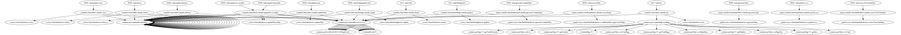

#### 高引用 + 高修改分析

执行 `coca count` 可以查看高引用的方法：

| REFS COUNT |                                METHOD                                 |
|------------|-----------------------------------------------------------------------|
|       8055 | com.macro.mall.model.GeneratedCriteria.addCriterion                   |
|        199 | com.macro.mall.common.api.CommonResult.success                        |
|        125 | com.macro.mall.common.api.CommonResult.failed                         |
|         30 | com.macro.mall.model.GeneratedCriteria.addCriterionForJDBCDate        |
|         23 | com.macro.mall.common.api.CommonPage.restPage                         |
|         20 | com.macro.mall.model.GeneratedCriteria.addCriterionForJDBCTime        |
|         17 | com.macro.mall.portal.service.UmsMemberService.getCurrentMember       |
|         17 | com.macro.mall.model.UmsMember.getId                                  |
|         16 | com.macro.mall.service.impl.PmsProductServiceImpl.relateAndInsertList |
|          7 | com.macro.mall.portal.domain.OrderParam.getUseIntegration             |
|          7 | com.macro.mall.portal.domain.OrderParam.getCouponId                   |

看上去，主要问题还在数据库查询语句拼接那一部分。

执行 `coca git -t` 可以查看经常修改的文件：

|                                               ENTITYNAME                                                | REVSCOUNT | AUTHORCOUNT |
|---------------------------------------------------------------------------------------------------------|-----------|-------------|
| README.md                                                                                               |       121 |           2 |
| document/pdm/mall.pdm                                                                                   |        29 |           2 |
| document/pdm/mall.pdb                                                                                   |        26 |           2 |
| mall-admin/pom.xml                                                                                      |        23 |           2 |
| mall-portal/pom.xml                                                                                     |        18 |           2 |
| document/sql/mall.sql                                                                                   |        16 |           2 |
| mall-portal/src/main/java/com/macro/mall/portal/service/impl/OmsPortalOrderServiceImpl.java             |        14 |           2 |
| mall-admin/src/main/java/com/macro/mall/controller/PmsBrandController.java                              |        14 |           2 |
| document/reference/deploy-windows.md                                                                    |        14 |           2 |
| mall-search/pom.xml                                                                                     |        14 |           2 |
| document/docker/docker-deploy.md                                                                        |        13 |           2 |

经常修改的地方是 pom 文件和文档，看上去没啥问题。考虑到 `OmsPortalOrderServiceImpl.java` 文件修改了 16 次，我决定打开这个文件看看：

1. 有一个 150 行左右的方法
2. 总行数 643 行

明显这是一个订单相关的上帝类，关联的 OmsOrder 模型有 40 ~ 50 左右的字段。毫无疑问，这里就是代码中经常出现问题的地方。

#### 测试

执行了 `coca tbs`，一共找到了这几个文件

```
Start parse java call: PmsDaoTests.java
Start parse java call: MallDemoApplicationTests.java
Start parse java call: MallPortalApplicationTests.java
Start parse java call: PortalProductDaoTests.java
Start parse java call: MallSearchApplicationTests.java
```

这个相当于是没有测试吧。

### 重构策略

1. 进行 DDD 建模
2. 搭建 E2E 测试
3. 引入 Flyway 做数据库迁移
4. 分层架构重构
5. 重构到充血模型
6. ……

### 架构重构

以下内容暂不免费开放。

### 分层重构

以下内容暂不免费开放。

### 模型重构

以下内容暂不免费开放。

### 代码重构

以下内容暂不免费开放。

## 自动化重构

TBD

## 数据库重构（TBC）

> 数据库重构，是对数据库 schema 的一个简单变更，在保持其行为语义和信息语义的同时，改进了它的设计。 —— 《数据库重构》

换言之，你既没有增加新功能，也没有破坏原有的功能，没有添加新的数据，也没有改变原有数据的语义。值得注意的是，尽管你的领域模型发生了变化，但是这也不意味着数据库 schema 需要因此而发生改变；与此同时，一些公司的制度也会限制我们对数据库进行重构。

它们之间的关系如下图所示：

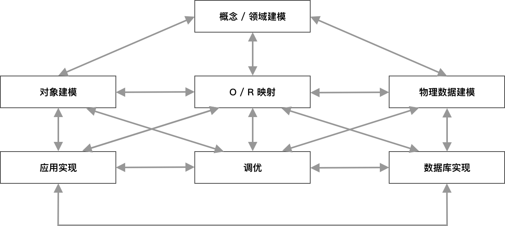

如《数据库重构》一书所说：数据库重构是一种数据库实现技术，就像代码重构是一种应用实现技术一样。当我们在不断对代码调优的同时，我们也在不断地对数据库进行调优。


### 数据库回归测试：数据不变性

#### 前测试

采用传统的数据库测试工具，如 DBUnit，SQLUnit，通过诸如 TDD 的方式来完成对数据库的测试，随后开展对代码的重构。

#### 后测试

为了对重构进行验证，我们需要对数据库进行回归测试。一种常见的做法是：

1. 录制行为数据
2. 通过回复验证功能不被破坏
3. 通过影子流量进行验证

这样的工具有很多，如我司吴大师写的 [DBdiff](https://github.com/XuefengWu/dbdiff)，可以用于 Oracle 数据库的迁移。

### 引入数据库迁移工具

尽管，我并没有实践过大规模的数据库重构，但是和其他/她的后端开发一样，在日常的开发中，我们也时不时会做一些数据库重构 —— 数据库迁移。

 - 代码版本控制
 - 数据库版本控制
 - 多数据识别

诸如于 Flyway 和 Liquibase 都是一些不错的工具。

### 迁移源数据

我尝试编写脚本来将我的博客 [https://www.phodal.com](https://www.phodal.com) 从 SQLite3 迁移到 MySQL，这并不是一件困难的事情。因为 SQLite3 是一种嵌入式数据库，而我们可以通过 `mysqldump` 出 MySQL 的数据。

如此一来，我们便可以用于做数据库重构练习，并编写数据库的回归测试。

### 汲取式重构：存储过程转换

对于采用 Oracle 的项目来说，数据重构不是一件容易的事情。它还涉及到一系列的存储过程代码。

所以，我们还可以尝试将 PLSQL 转为 Kotlin 代码：https://github.com/XuefengWu/LADE_Analysis

## 重构之后：工具的问题

### 架构守护

在重构的过程中，我们也可以尝试将它引入到系统中使用。它可以作为我们的架构适应度函数，不断地见证我们架构的变化和成长 —— 以一种肉眼的方式持续演进。

#### 架构守护测试

ArchUnit 是一个不错的架构守护框架。你可以尝试引入项目的架构中，

#### 坏味道守护

我的意思是，只需要集成到持续构建中即可。

### 测试驱动开发 

测试驱动开发适合于解决复杂的问题。

我并不是一个 TDD 的死忠粉，但是我发现 TDD 非常适合于解决复杂问题。在这个场景下，我有一堆事先准备好的 Test Bad Smell，它们拥有一些对应的检测规则，这些规则相互之间存在一些影响。因此，我将这些 Bad Smell 作为我的测试用例：

```
AssertionRouletteTest.java
ConditionalTest.java
ConstructorInitializationTest.java
DuplicateAssertTest.java
EmptyTest.java
IgnoreTest.java
MagicNumberTest.java
MysteryGuestTest.java
RedundantAssertionTest.java
```

于是，我可以写出我的第一个测试：

```java
func TestTbsApp_EmptyTest(t *testing.T) {
	g := NewGomegaWithT(t)
	var codePath = "../../../_fixtures/tbs/code/EmptyTest.java"

	var result = buildTbsResult(codePath)

	g.Expect(result[0].Type).To(Equal("EmptyTest"))
}
```

对应的一步步完成出整个功能的代码。而后，我们就可以重构出理想的代码 —— 因为我们已经有了对应的测试。

### 完善基础设施

## 重构之后：解决人的问题

我们把所有的问题都归到人的问题。

### 代码写得烂

如我们所见，我们在不同的公司里，会看到不同的人写出来的代码水平是不一样的。比如有一些是由供应商写的代码

不过，既然给这引起供应商的工资本身就不高，那么怎么能指望出他/她写出好的代码。

与此同时，由于种种原因，教他们学习的成本又特别高，甚至于你还要担心如果你教会了供应商，他/她们可能寻找一个新的工作。

### 养成优秀的开发习惯

### 人员能力提升

#### 练习项目

#### 培训教程

#### 典型问题

## 重构之后：流程的问题

### 流程优化

我们在开发的前期缺少对于系统的设计，那么我们将需要花费大量的成本在后期修复他们。

你可以查看我先前写的《[新项目检查清单](https://www.phodal.com/blog/new-project-check-lists/)》完善项目的启动流程，通过 [https://phodal.github.io/new-project-checklist/](https://phodal.github.io/new-project-checklist/) 可以使用这个工具。并借助于《[如何创建你的应用脚手架](https://www.phodal.com/blog/how-to-create-application-boilerplate/)》搭建好项目的脚手架。

借助于 Path to Production [优化你的上线流程](https://www.phodal.com/blog/tech-lead-tools-path-to-production/)

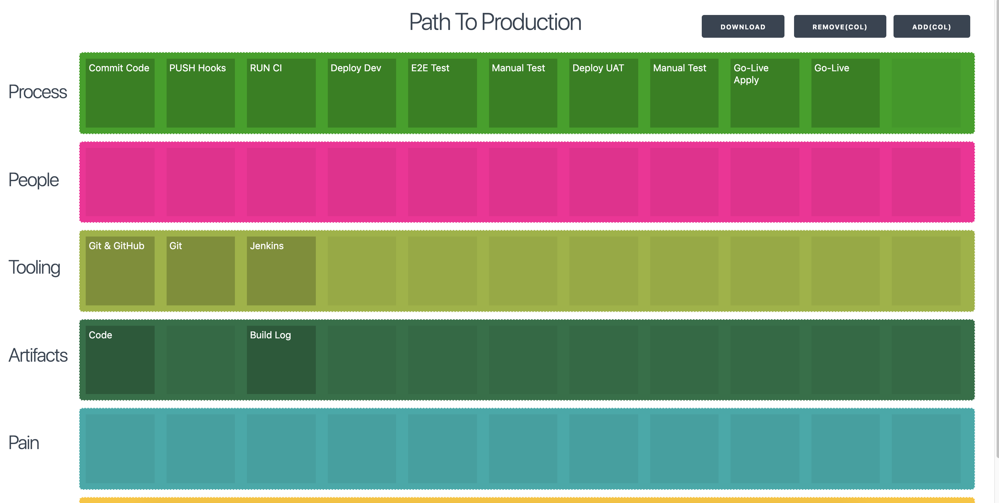

工具见：[https://phodal.github.io/path/](https://phodal.github.io/path/)

你可以在我的 Tech Lead 工具箱中，获得更多工具：https://github.com/phodal/techlead

### 需求规范化

#### 实例化需求

#### 行为驱动开发（BDD）

> 行为驱动开发是一种敏捷软件开发的技术，它鼓励软件项目中的开发者、QA 和非技术人员或商业参与者之间的协作。

年轻的时候（我刚毕业），我并不懂得 BDD 的好处——相当的繁琐，到了现在我又有一番不一样的体会。思来想去主要的原因是，当时我们是一个全功能的团队，不存在跨部门协作，也因此我并不觉得 BDD 能为我们带来多大的好处。

可是在 ThoughtWorks 公司之外，开发、测试和业务都是各自的部门，有着各自的利益。通过 BDD 的协作方式，可以让交付物有一个一致的观点。

## 重构之后：提炼知识

### 知识仓库

预先设计：

 - 一无是处的代码注释。
 - 没有搭建信息的 README。
 - 没有版本化的、二进制的项目文档

### 重建知识仓库

请参考：[构建可信软件系统](https://github.com/phodal/trusted)

## 问题是什么？

### 为什么我们需要重构？

这个问题，就该你回答了：为什么我们需要重构？

## 重构到微服务

重构比重写来得更有价值。重写往往有可能带来更多的技术债，还可能犯上同样的错误。

你为什么不重写呢？？？

这样更省时间？

## 未来

未来 10 年，你应当：

### 追求技术卓越。

### 推动个人变革，进而引领组织变革

### 整理知识，加强教育

### 在整个流程中将价值创造最大化


LICENSE
---

[](https://www.phodal.com/)

© 2020 [Phodal Huang](https://www.phodal.com). This code is distributed under the Creative Commons Attribution-Noncommercial-No Derivative Works 4.0  License. See `LICENSE` in this directory.

[](http://www.xuntayizhan.com/person/ji-ke-ai-qing-zhi-er-shi-dai-wo-dai-ma-bian-cheng-qu-ni-wei-qi-ke-hao-wan/)
